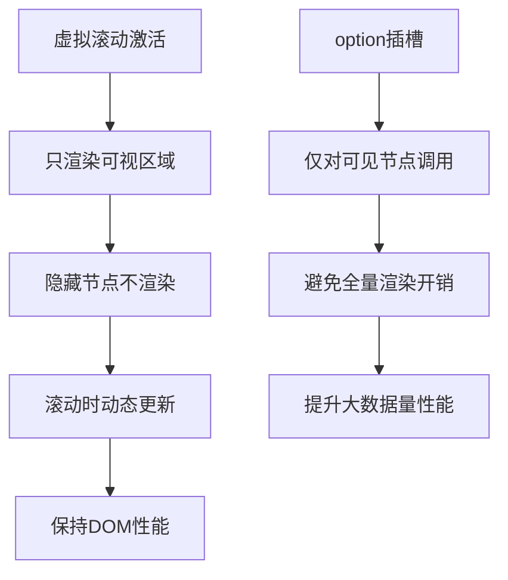

# option 插槽

<cite>
**本文档引用的文件**
- [Option.vue](file://src/components/Option.vue)
- [treeselectMixin.js](file://src/mixins/treeselectMixin.js)
- [VirtualList.vue](file://src/components/VirtualList.vue)
- [CustomizeOptionLabel.vue](file://docs/components/CustomizeOptionLabel.vue)
- [CustomizeValueLabel.vue](file://docs/components/CustomizeValueLabel.vue)
- [DocSlots.vue](file://docs/components/DocSlots.vue)
- [PERFORMANCE_OPTIMIZATION_GUIDE.md](file://PERFORMANCE_OPTIMIZATION_GUIDE.md)
</cite>

## 概述

`option` 插槽是 Vue Treeselect 组件中的一个重要插槽，它允许开发者自定义下拉菜单中每个选项的渲染内容。通过这个插槽，你可以完全控制选项的外观和交互行为，实现各种高级UI效果。

## 插槽作用域数据结构

`option` 插槽提供了丰富的作用域数据，这些数据封装在一个对象中传递给插槽函数：

### 核心节点属性

| 属性名 | 类型 | 描述 |
|--------|------|------|
| `node` | Object | 完整的节点对象，包含以下核心属性 |
| `node.id` | String/Number | 节点唯一标识符 |
| `node.label` | String | 节点显示标签 |
| `node.isLeaf` | Boolean | 是否为叶子节点（无子节点） |
| `node.isBranch` | Boolean | 是否为分支节点（有子节点） |
| `node.level` | Number | 节点在树中的层级（根节点为0） |
| `node.isDisabled` | Boolean | 节点是否被禁用 |
| `node.isHighlighted` | Boolean | 节点是否被高亮 |
| `node.isMatched` | Boolean | 节点是否在搜索中匹配 |

### 显示控制属性

| 属性名 | 类型 | 描述 |
|--------|------|------|
| `shouldShowCount` | Boolean | 是否应该显示计数信息 |
| `count` | Number | 节点的计数值（根据配置显示不同类型） |
| `labelClassName` | String | 标签元素的CSS类名 |
| `countClassName` | String | 计数元素的CSS类名 |

### 实际使用示例

```vue
<template>
  <treeselect :options="options">
    <div slot="option-label" slot-scope="{ node, shouldShowCount, count, labelClassName, countClassName }">
      <!-- 自定义选项内容 -->
    </div>
  </treeselect>
</template>
```

## 基本使用方法

### 1. 基础自定义标签

最简单的用法是自定义节点的显示标签：

```vue
<template>
  <treeselect :options="options">
    <div slot="option-label" slot-scope="{ node }">
      {{ node.label }}
    </div>
  </treeselect>
</template>
```

### 2. 添加状态指示器

```vue
<template>
  <treeselect :options="options">
    <div slot="option-label" slot-scope="{ node, labelClassName }">
      <span :class="labelClassName">
        {{ node.label }}
        <span v-if="node.isLeaf" class="leaf-icon">📄</span>
        <span v-if="node.isBranch" class="branch-icon">📁</span>
      </span>
    </div>
  </treeselect>
</template>
```

### 3. 显示计数信息

```vue
<template>
  <treeselect :options="options" :show-count="true">
    <div slot="option-label" slot-scope="{ node, shouldShowCount, count, labelClassName, countClassName }">
      <span :class="labelClassName">
        {{ node.label }}
        <span v-if="shouldShowCount" :class="countClassName">({{ count }})</span>
      </span>
    </div>
  </treeselect>
</template>
```

## 高级UI效果实现

### 1. 图标集成

```vue
<template>
  <treeselect :options="options">
    <div slot="option-label" slot-scope="{ node, labelClassName }">
      <span :class="labelClassName">
        <i :class="getNodeIcon(node)" class="option-icon"></i>
        {{ node.label }}
      </span>
    </div>
  </treeselect>
</template>

<script>
export default {
  methods: {
    getNodeIcon(node) {
      if (node.isLeaf) return 'fas fa-file'
      if (node.isBranch) return 'fas fa-folder'
      return 'fas fa-circle'
    }
  }
}
</script>
```

### 2. 多行文本显示

```vue
<template>
  <treeselect :options="options">
    <div slot="option-label" slot-scope="{ node, labelClassName }">
      <div :class="labelClassName">
        <div class="primary-text">{{ node.label }}</div>
        <div class="secondary-text">{{ node.raw.description }}</div>
      </div>
    </div>
  </treeselect>
</template>
```

### 3. 状态标记系统

```vue
<template>
  <treeselect :options="options">
    <div slot="option-label" slot-scope="{ node, labelClassName }">
      <span :class="labelClassName">
        <span :class="getStatusClass(node)" class="status-dot"></span>
        {{ node.label }}
      </span>
    </div>
  </treeselect>
</template>

<style>
.status-dot {
  display: inline-block;
  width: 8px;
  height: 8px;
  border-radius: 50%;
  margin-right: 6px;
}

.status-dot.active { background-color: #4CAF50; }
.status-dot.inactive { background-color: #F44336; }
.status-dot.pending { background-color: #FFC107; }
</style>
```

## 虚拟滚动场景下的行为表现

### 虚拟滚动模式的特点

在启用虚拟滚动（`virtual-scroll="true"`）的情况下，`option` 插槽的行为有一些特殊之处：

#### 1. 渲染优化



**图表来源**
- [VirtualList.vue](file://src/components/VirtualList.vue#L157-L222)

#### 2. 性能注意事项

在虚拟滚动模式下使用 `option` 插槽时需要注意：

- **固定高度要求**: 选项必须有固定的像素高度，通过 `option-height` 属性设置
- **避免复杂计算**: 插槽内容应尽量简单，避免复杂的计算逻辑
- **缓存机制**: 对于重复使用的模板，考虑使用Vue的缓存机制

### 虚拟滚动配置示例

```vue
<template>
  <treeselect
    :options="largeDataset"
    :virtual-scroll="true"
    :option-height="40"
    :default-expand-level="0"
  >
    <div slot="option-label" slot-scope="{ node }">
      <!-- 简单高效的选项渲染 -->
      <span class="icon">{{ getIcon(node) }}</span>
      <span class="label">{{ node.label }}</span>
      <span class="count" v-if="node.isBranch">({{ node.count.all }})</span>
    </div>
  </treeselect>
</template>
```

## 搜索场景下的行为表现

### 搜索高亮状态

在搜索过程中，节点会获得特殊的高亮状态：

```vue
<template>
  <treeselect :options="options" searchable>
    <div slot="option-label" slot-scope="{ node, labelClassName }">
      <span :class="[labelClassName, { highlighted: node.isMatched }]">
        {{ node.label }}
        <span v-if="node.isMatched" class="match-highlight">✓</span>
      </span>
    </div>
  </treeselect>
</template>
```

### 搜索结果过滤

```vue
<template>
  <treeselect :options="options" searchable>
    <div slot="option-label" slot-scope="{ node, shouldShowCount, count }">
      <div v-if="shouldShowCount" class="search-result">
        <span class="label">{{ node.label }}</span>
        <span class="count">({{ count }})</span>
      </div>
      <div v-else class="normal-option">
        {{ node.label }}
      </div>
    </div>
  </treeselect>
</template>
```

## 常见错误用法

### 1. 忽略作用域参数

```vue
<!-- ❌ 错误：未正确使用作用域参数 -->
<template>
  <treeselect :options="options">
    <div slot="option-label">
      {{ node.label }} <!-- node 未定义 -->
    </div>
  </treeselect>
</template>

<!-- ✅ 正确：正确使用作用域参数 -->
<template>
  <treeselect :options="options">
    <div slot="option-label" slot-scope="{ node }">
      {{ node.label }}
    </div>
  </treeselect>
</template>
```

### 2. 在插槽中修改原始数据

```vue
<!-- ❌ 错误：直接修改原始节点数据 -->
<template>
  <treeselect :options="options">
    <div slot="option-label" slot-scope="{ node }">
      <span>{{ node.label.toUpperCase() }}</span>
      <!-- 这会影响原始数据，可能导致意外行为 -->
    </div>
  </treeselect>
</template>

<!-- ✅ 正确：使用计算属性或本地变量 -->
<template>
  <treeselect :options="options">
    <div slot="option-label" slot-scope="{ node }">
      <span>{{ formattedLabel(node) }}</span>
    </div>
  </treeselect>
</template>
```

### 3. 忽略性能影响

```vue
<!-- ❌ 错误：在插槽中进行复杂计算 -->
<template>
  <treeselect :options="options">
    <div slot="option-label" slot-scope="{ node }">
      <!-- 复杂计算在每次渲染时都会执行 -->
      <span>{{ expensiveCalculation(node) }}</span>
    </div>
  </treeselect>
</template>

<!-- ✅ 正确：使用缓存或计算属性 -->
<template>
  <treeselect :options="options">
    <div slot="option-label" slot-scope="{ node }">
      <span>{{ cachedCalculations[node.id] }}</span>
    </div>
  </treeselect>
</template>
```

## 性能优化建议

### 1. 避免不必要的DOM操作

```vue
<!-- ❌ 低效：频繁的条件渲染 -->
<template>
  <treeselect :options="options">
    <div slot="option-label" slot-scope="{ node }">
      <span v-if="node.isBranch">📁</span>
      <span v-else-if="node.isLeaf">📄</span>
      <span v-else>•</span>
      {{ node.label }}
    </div>
  </treeselect>
</template>

<!-- ✅ 高效：预计算图标 -->
<template>
  <treeselect :options="options">
    <div slot="option-label" slot-scope="{ node, iconClass }">
      <span :class="iconClass"></span>
      {{ node.label }}
    </div>
  </treeselect>
</template>
```

### 2. 使用计算属性缓存

```javascript
computed: {
  optionTemplate() {
    return ({ node }) => {
      // 缓存计算结果
      if (!this.cachedIcons[node.id]) {
        this.cachedIcons[node.id] = this.getIconClass(node)
      }
      return this.cachedIcons[node.id]
    }
  }
}
```

### 3. 虚拟滚动优化

```vue
<template>
  <treeselect
    :options="largeDataset"
    :virtual-scroll="true"
    :option-height="40"
    :default-expand-level="0"
  >
    <div slot="option-label" slot-scope="{ node }">
      <!-- 简单高效：避免复杂模板 -->
      <span class="simple-icon">{{ getSimpleIcon(node) }}</span>
      <span class="simple-label">{{ node.label }}</span>
    </div>
  </treeselect>
</template>
```

### 4. 性能监控指标

| 指标 | 目标值 | 监控方法 |
|------|--------|----------|
| 渲染时间 | < 16ms | Performance API |
| DOM节点数 | < 50个 | DevTools |
| 内存使用 | < 50MB | Memory Tab |
| 帧率 | > 60fps | Chrome DevTools |

**节来源**
- [Option.vue](file://src/components/Option.vue#L166-L209)
- [VirtualList.vue](file://src/components/VirtualList.vue#L157-L222)
- [PERFORMANCE_OPTIMIZATION_GUIDE.md](file://PERFORMANCE_OPTIMIZATION_GUIDE.md#L1-L213)

## 总结

`option` 插槽是 Vue Treeselect 组件中功能强大的定制化工具，它允许开发者：

1. **完全控制选项外观**：自定义标签、图标、状态指示器等
2. **实现高级UI效果**：多行文本、状态标记、图标集成等
3. **优化大数据量场景**：配合虚拟滚动提升性能
4. **适应不同搜索场景**：处理搜索高亮和结果过滤

在使用时要注意性能优化，特别是在处理大量数据时，合理使用虚拟滚动和缓存机制可以显著提升用户体验。