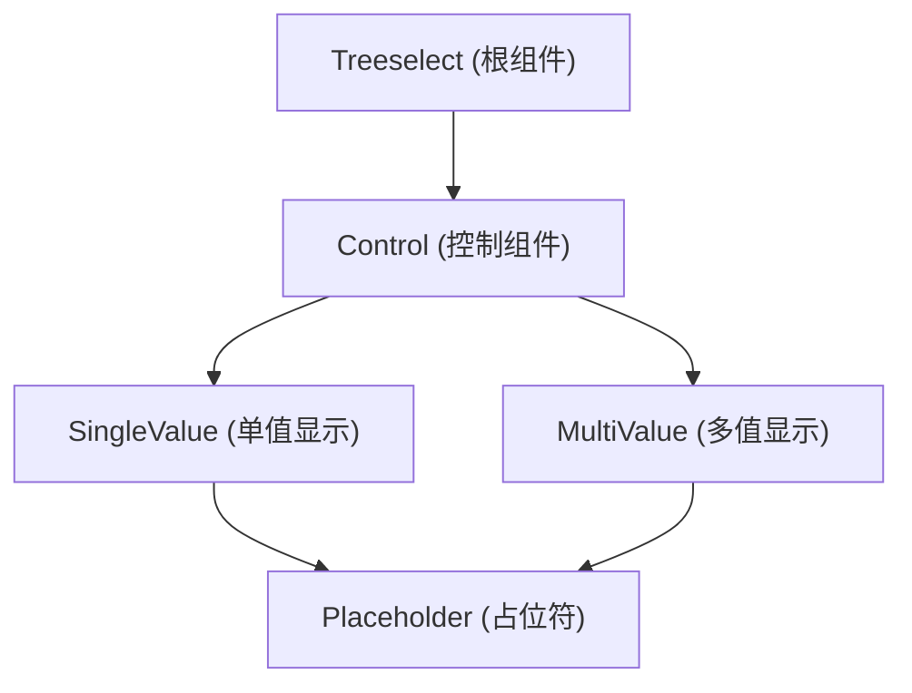
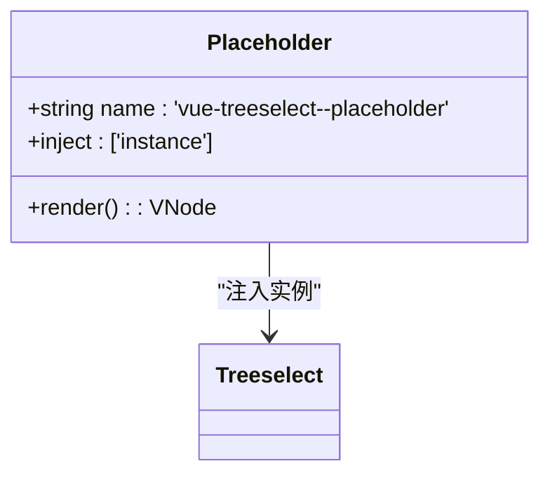
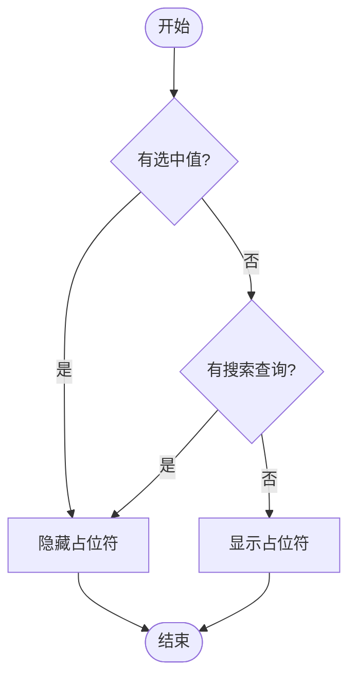
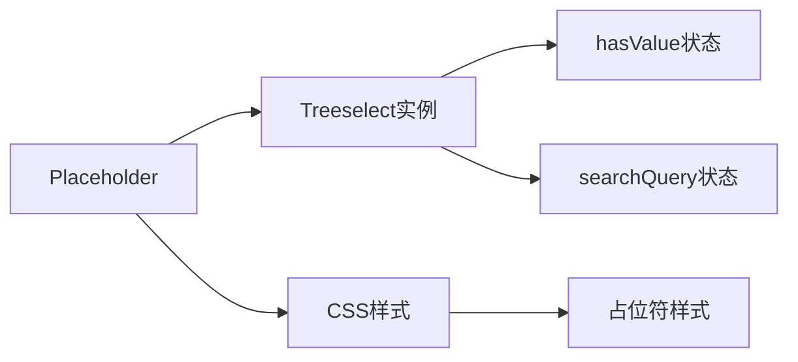

# placeholder 插槽

<cite>
**本文档引用的文件**   
- [Placeholder.vue](file://src/components/Placeholder.vue)
- [SingleValue.vue](file://src/components/SingleValue.vue)
- [MultiValue.vue](file://src/components/MultiValue.vue)
- [treeselectMixin.js](file://src/mixins/treeselectMixin.js)
- [vue-treeselect.css](file://dist/vue-treeselect.css)
</cite>

## 目录
1. [简介](#简介)
2. [核心组件](#核心组件)
3. [架构概述](#架构概述)
4. [详细组件分析](#详细组件分析)
5. [依赖分析](#依赖分析)
6. [性能考虑](#性能考虑)
7. [故障排除指南](#故障排除指南)
8. [结论](#结论)

## 简介
`placeholder` 插槽是 Treeselect 组件中的一个重要功能，用于在没有选中值时显示占位符内容。该插槽允许开发者插入富文本、图标或动态提示信息，从而增强用户体验。当组件处于未选中状态且没有搜索查询时，该插槽的内容会被显示。此外，`placeholder` 插槽与 `placeholder` prop 存在优先级关系，插槽内容会覆盖 prop 定义的文本。

## 核心组件

`placeholder` 插槽主要由 `Placeholder.vue` 组件实现，该组件通过注入 `instance` 来访问 Treeselect 实例的状态。其显示逻辑基于 `hasValue` 和 `searchQuery` 两个状态：当组件没有选中值且用户未输入搜索内容时，占位符才会显示。该组件还负责管理占位符的样式类，确保其在不同状态下正确显示或隐藏。

**Section sources**
- [Placeholder.vue](file://src/components/Placeholder.vue#L1-L21)

## 架构概述

Treeselect 组件的整体架构采用模块化设计，`Placeholder` 组件作为子组件嵌入到 `SingleValue` 和 `MultiValue` 组件中。这种设计使得占位符能够在单选和多选模式下统一管理。组件通过 Vue 的 `inject/provide` 机制获取父级实例，实现了状态的高效传递。

**Diagram sources **
- [Treeselect.vue](file://src/components/Treeselect.vue#L1-L41)
- [Control.vue](file://src/components/Control.vue#L1-L154)
- [SingleValue.vue](file://src/components/SingleValue.vue#L1-L34)
- [MultiValue.vue](file://src/components/MultiValue.vue#L1-L57)

## 详细组件分析

### Placeholder 组件分析

`Placeholder` 组件是实现占位符功能的核心。它通过计算属性判断是否应该显示，并根据组件状态应用相应的 CSS 类。组件的渲染逻辑简单高效，仅在需要时显示占位符内容。

#### 组件实现

**Diagram sources **
- [Placeholder.vue](file://src/components/Placeholder.vue#L1-L21)

### 占位符显示逻辑

占位符的显示由两个关键条件控制：`hasValue` 和 `searchQuery`。只有当这两个条件都为假时，占位符才会显示。这一逻辑确保了在有选中值或正在进行搜索时，占位符不会干扰用户界面。

**Diagram sources **
- [Placeholder.vue](file://src/components/Placeholder.vue#L11-L12)

## 依赖分析

`Placeholder` 组件依赖于 Treeselect 实例的核心状态，包括 `hasValue` 和 `trigger.searchQuery`。这些状态通过 `inject` 机制从父组件传递，形成了清晰的依赖关系。同时，组件样式依赖于全局 CSS 类，确保了视觉一致性。

**Diagram sources **
- [Placeholder.vue](file://src/components/Placeholder.vue#L4-L8)
- [vue-treeselect.css](file://dist/vue-treeselect.css#L153-L175)

**Section sources**
- [Placeholder.vue](file://src/components/Placeholder.vue#L1-L21)
- [vue-treeselect.css](file://dist/vue-treeselect.css#L153-L175)

## 性能考虑

`Placeholder` 组件的实现非常轻量，仅包含简单的条件渲染和类名绑定。由于其依赖的状态变化频率较低，因此不会对性能造成显著影响。组件的虚拟 DOM 更新效率高，能够快速响应状态变化。

## 故障排除指南

当 `placeholder` 插槽无法正常显示时，应检查以下几点：
1. 确认组件确实没有选中值（`hasValue` 为 false）
2. 确认用户没有输入搜索内容（`searchQuery` 为空）
3. 检查插槽内容是否正确声明
4. 验证 CSS 类是否被正确应用

**Section sources**
- [Placeholder.vue](file://src/components/Placeholder.vue#L11-L12)

## 结论

`placeholder` 插槽为 Treeselect 组件提供了灵活的占位符显示能力。通过合理的架构设计和高效的实现，该功能能够在不影响性能的前提下，为用户提供清晰的界面提示。开发者可以充分利用这一特性，创建更加友好的用户界面。