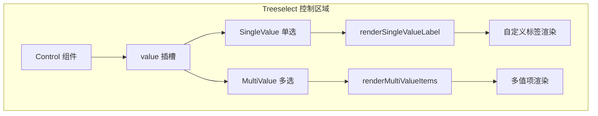

# value 插槽

<cite>
**本文档中引用的文件**
- [Treeselect.vue](file://src/components/Treeselect.vue)
- [Control.vue](file://src/components/Control.vue)
- [SingleValue.vue](file://src/components/SingleValue.vue)
- [MultiValue.vue](file://src/components/MultiValue.vue)
- [Input.vue](file://src/components/Input.vue)
- [treeselectMixin.js](file://src/mixins/treeselectMixin.js)
- [VirtualList.vue](file://src/components/VirtualList.vue)
- [Slots.spec.js](file://test/unit/specs/Slots.spec.js)
</cite>

## 目录
1. [简介](#简介)
2. [插槽概述](#插槽概述)
3. [作用域数据详解](#作用域数据详解)
4. [单选模式下的使用](#单选模式下的使用)
5. [多选模式下的使用](#多选模式下的使用)
6. [自定义标签样式](#自定义标签样式)
7. [动态内容渲染](#动态内容渲染)
8. [交互元素集成](#交互元素集成)
9. [虚拟滚动兼容性](#虚拟滚动兼容性)
10. [搜索功能兼容性](#搜索功能兼容性)
11. [常见问题解决方案](#常见问题解决方案)
12. [最佳实践](#最佳实践)

## 简介

`value` 插槽是 Vue Treeselect 组件中的一个重要插槽，专门用于自定义已选值在控制区域的显示方式。该插槽提供了强大的灵活性，允许开发者完全控制选中节点的视觉呈现，包括单选和多选两种模式下的不同显示策略。

## 插槽概述

`value` 插槽位于 Treeselect 控制区域的核心位置，负责渲染当前选中的值或值集合。它支持两种主要模式：

- **单选模式**：显示单个选中节点
- **多选模式**：显示多个选中节点的集合



**图表来源**
- [Control.vue](file://src/components/Control.vue#L140-L150)
- [SingleValue.vue](file://src/components/SingleValue.vue#L19-L33)
- [MultiValue.vue](file://src/components/MultiValue.vue#L35-L56)

## 作用域数据详解

### selectedNodes 数组

在多选模式下，`value` 插槽接收到的 `selectedNodes` 数组包含了所有当前选中的节点对象。这个数组具有以下特性：

- **顺序性**：按照用户选择的顺序排列
- **完整性**：包含所有已选节点的完整信息
- **可访问性**：每个节点都可以通过索引直接访问

### node 对象结构

每个节点对象包含丰富的属性信息：

| 属性名 | 类型 | 描述 |
|--------|------|------|
| `id` | String | 节点唯一标识符 |
| `label` | String | 节点显示文本 |
| `children` | Array | 子节点数组（分支节点） |
| `isBranch` | Boolean | 是否为分支节点 |
| `isLeaf` | Boolean | 是否为叶子节点 |
| `isDisabled` | Boolean | 是否被禁用 |
| `level` | Number | 节点层级深度 |
| `parentNode` | Object | 父节点对象 |
| `ancestors` | Array | 所有祖先节点 |

### 多选模式限制

在多选模式下，`value` 插槽会受到以下限制：

- **数量限制**：受 `limit` 属性控制，默认不限制
- **性能优化**：只渲染可见范围内的节点
- **状态同步**：自动与组件内部状态保持同步

**章节来源**
- [treeselectMixin.js](file://src/mixins/treeselectMixin.js#L725-L751)
- [MultiValue.vue](file://src/components/MultiValue.vue#L11-L20)

## 单选模式下的使用

在单选模式下，`value` 插槽只处理单个节点的显示。由于只有一个节点，可以直接访问 `node` 对象的所有属性。

### 基本用法示例

```javascript
// 单选模式下的 value 插槽使用
{
  template: `
    <treeselect
      v-model="selectedValue"
      :options="options"
      multiple="false"
    >
      <template #value="{ node }">
        <div class="custom-single-value">
          <span>{{ node.label }}</span>
          <span class="badge">{{ node.id }}</span>
        </div>
      </template>
    </treeselect>
  `
}
```

### 节点状态判断

在单选模式下，可以利用节点的各种状态属性：

```javascript
// 判断节点状态的示例
{
  template: `
    <template #value="{ node }">
      <div :class="['node-status', {
        'is-disabled': node.isDisabled,
        'is-branch': node.isBranch,
        'is-leaf': node.isLeaf
      }]">
        <span>{{ node.label }}</span>
        <span class="status-icon">{{ getStatusIcon(node) }}</span>
      </div>
    </template>
  `
}
```

**章节来源**
- [SingleValue.vue](file://src/components/SingleValue.vue#L9-L17)

## 多选模式下的使用

在多选模式下，`value` 插槽接收到的是一个包含多个节点的数组，需要特别注意性能优化和用户体验。

### 基本多选渲染

```javascript
// 多选模式下的基本渲染
{
  template: `
    <treeselect
      v-model="selectedValues"
      :options="options"
      multiple="true"
    >
      <template #value="{ selectedNodes }">
        <div class="multi-value-container">
          <div v-for="node in selectedNodes" :key="node.id" 
               class="tag-item">
            {{ node.label }}
          </div>
        </div>
      </template>
    </treeselect>
  `
}
```

### 分页和限制处理

当选择数量超过限制时，需要特殊处理：

```javascript
// 处理选择数量限制的示例
{
  template: `
    <treeselect
      v-model="selectedValues"
      :options="options"
      multiple="true"
      :limit="5"
    >
      <template #value="{ selectedNodes, instance }">
        <div class="limited-multi-values">
          <div v-for="node in selectedNodes.slice(0, instance.limit)" 
               :key="node.id" class="tag-item">
            {{ node.label }}
          </div>
          
          <!-- 显示超出的数量 -->
          <div v-if="selectedNodes.length > instance.limit"
               class="overflow-indicator">
            +{{ selectedNodes.length - instance.limit }}
          </div>
        </div>
      </template>
    </treeselect>
  `
}
```

### 性能优化考虑

对于大量选择的情况，建议使用虚拟滚动：

```javascript
// 虚拟滚动优化示例
{
  template: `
    <treeselect
      v-model="selectedValues"
      :options="options"
      multiple="true"
      :virtual-scroll="true"
      :option-height="32"
    >
      <template #value="{ selectedNodes }">
        <div class="virtual-multi-values">
          <div v-for="node in selectedNodes" :key="node.id"
               class="virtual-item">
            {{ node.label }}
          </div>
        </div>
      </template>
    </treeselect>
  `
}
```

**章节来源**
- [MultiValue.vue](file://src/components/MultiValue.vue#L11-L20)
- [treeselectMixin.js](file://src/mixins/treeselectMixin.js#L346-L355)

## 自定义标签样式

### 基础样式定制

```javascript
// 标签样式的自定义示例
{
  template: `
    <template #value="{ node }">
      <span class="custom-tag" :style="{
        backgroundColor: getNodeColor(node),
        color: getContrastColor(getNodeColor(node)),
        borderRadius: '4px',
        padding: '2px 8px',
        fontSize: '12px'
      }">
        {{ node.label }}
      </span>
    </template>
  `
}
```

### 动态颜色方案

```javascript
// 基于节点类型的动态颜色
{
  methods: {
    getNodeColor(node) {
      if (node.isBranch) return '#e6f7ff'
      if (node.isDisabled) return '#f5f5f5'
      return '#d6eaff'
    },
    
    getContrastColor(hex) {
      // 颜色对比度算法
      const r = parseInt(hex.slice(1, 3), 16)
      const g = parseInt(hex.slice(3, 5), 16)
      const b = parseInt(hex.slice(5, 7), 16)
      
      const brightness = (r * 299 + g * 587 + b * 114) / 1000
      return brightness > 128 ? '#000' : '#fff'
    }
  }
}
```

### 状态指示器

```javascript
// 添加状态指示器的示例
{
  template: `
    <template #value="{ node }">
      <div class="tag-with-status">
        <span class="status-dot" :class="getStatusClass(node)" />
        <span class="tag-label">{{ node.label }}</span>
        <span v-if="node.isDisabled" class="disabled-overlay" />
      </div>
    </template>
  `
}
```

## 动态内容渲染

### 条件渲染

根据节点的不同状态渲染不同的内容：

```javascript
// 条件渲染示例
{
  template: `
    <template #value="{ node }">
      <div class="conditional-rendering">
        <span v-if="node.isBranch" class="branch-icon">📁</span>
        <span v-else class="leaf-icon">📄</span>
        
        <span :class="['node-label', {
          'is-disabled': node.isDisabled,
          'is-selected': isSelected(node)
        }]">
          {{ node.label }}
        </span>
        
        <span v-if="node.children && node.children.length" 
              class="child-count">
          ({{ node.children.length }})
        </span>
      </div>
    </template>
  `
}
```

### 异步数据加载

```javascript
// 异步数据加载示例
{
  data() {
    return {
      nodeDetails: {}
    }
  },
  
  methods: {
    async loadNodeDetails(node) {
      if (!this.nodeDetails[node.id]) {
        // 模拟异步加载
        const details = await this.fetchNodeDetails(node.id)
        this.$set(this.nodeDetails, node.id, details)
      }
      return this.nodeDetails[node.id]
    }
  },
  
  template: `
    <template #value="{ node }">
      <div class="async-content">
        <span>{{ node.label }}</span>
        <span v-if="nodeDetails[node.id]" 
              class="details">
          {{ nodeDetails[node.id].description }}
        </span>
      </div>
    </template>
  `
}
```

### 图标和媒体内容

```javascript
// 图标和媒体内容渲染
{
  template: `
    <template #value="{ node }">
      <div class="media-tag">
        
        <span v-else class="fallback-icon">📄</span>
        
        <span class="node-title">{{ node.label }}</span>
        
        <span v-if="node.description" 
              class="node-description">
          {{ node.description }}
        </span>
      </div>
    </template>
  `
}
```

## 交互元素集成

### 删除按钮

```javascript
// 集成删除按钮的示例
{
  methods: {
    removeNode(node) {
      // 实现移除逻辑
      this.$emit('remove-node', node)
    }
  },
  
  template: `
    <template #value="{ node }">
      <div class="interactive-tag">
        <span class="tag-content">{{ node.label }}</span>
        <button @click.stop="removeNode(node)"
                class="remove-btn">
          ×
        </button>
      </div>
    </template>
  `
}
```

### 下拉菜单

```javascript
// 集成下拉菜单的示例
{
  data() {
    return {
      showMenu: false
    }
  },
  
  methods: {
    toggleMenu() {
      this.showMenu = !this.showMenu
    }
  },
  
  template: `
    <template #value="{ node }">
      <div class="menu-container">
        <div class="tag-with-menu" @click="toggleMenu">
          <span>{{ node.label }}</span>
          <span class="dropdown-arrow">▼</span>
        </div>
        
        <div v-show="showMenu" class="context-menu">
          <div @click="handleAction('edit')" class="menu-item">
            编辑
          </div>
          <div @click="handleAction('delete')" class="menu-item">
            删除
          </div>
        </div>
      </div>
    </template>
  `
}
```

### 工具提示

```javascript
// 集成工具提示的示例
{
  template: `
    <template #value="{ node }">
      <div class="tooltip-container">
        <span class="tooltip-trigger">{{ node.label }}</span>
        
        <div v-if="node.tooltip" class="tooltip-content">
          <div class="tooltip-header">
            <span class="node-type">{{ node.isBranch ? '分支' : '叶子' }}</span>
            <span class="node-id">{{ node.id }}</span>
          </div>
          <div class="tooltip-body">
            {{ node.tooltip }}
          </div>
        </div>
      </div>
    </template>
  `
}
```

## 虚拟滚动兼容性

### 基本兼容性

`value` 插槽与虚拟滚动功能完全兼容，但在使用时需要注意以下几点：

1. **性能优化**：避免在插槽中进行复杂的DOM操作
2. **内存管理**：及时清理事件监听器和定时器
3. **渲染时机**：确保在正确的生命周期钩子中执行操作

### 虚拟滚动配置

```javascript
// 虚拟滚动配置示例
{
  template: `
    <treeselect
      v-model="selectedValues"
      :options="options"
      multiple="true"
      :virtual-scroll="true"
      :option-height="32"
      :max-height="300"
    >
      <template #value="{ selectedNodes }">
        <div class="virtual-safe-render">
          <div v-for="node in selectedNodes" :key="node.id"
               class="virtual-item">
            {{ node.label }}
          </div>
        </div>
      </template>
    </treeselect>
  `
}
```

### 滚动性能优化

```javascript
// 滚动性能优化示例
{
  methods: {
    optimizeRender(nodes) {
      // 只渲染可见区域的节点
      const visibleNodes = nodes.slice(0, 10)
      return visibleNodes
    }
  },
  
  template: `
    <template #value="{ selectedNodes }">
      <div class="optimized-render">
        <div v-for="node in optimizeRender(selectedNodes)" 
             :key="node.id" class="item">
          {{ node.label }}
        </div>
      </div>
    </template>
  `
}
```

**章节来源**
- [VirtualList.vue](file://src/components/VirtualList.vue#L157-L222)

## 搜索功能兼容性

### 搜索状态检测

在搜索状态下，`value` 插槽可以通过 `instance.trigger.searchQuery` 来检测当前是否处于搜索状态：

```javascript
// 搜索状态检测示例
{
  template: `
    <template #value="{ node, instance }">
      <div :class="['search-aware', {
        'is-searching': instance.trigger.searchQuery,
        'has-match': node.isMatched
      }]">
        <span>{{ node.label }}</span>
        <span v-if="node.isMatched" class="match-highlight">
          (匹配项)
        </span>
      </div>
    </template>
  `
}
```

### 搜索高亮

```javascript
// 搜索高亮示例
{
  methods: {
    highlightSearchTerm(text, searchTerm) {
      if (!searchTerm) return text
      
      const regex = new RegExp(`(${searchTerm})`, 'gi')
      return text.replace(regex, '<mark>$1</mark>')
    }
  },
  
  template: `
    <template #value="{ node, instance }">
      <div class="highlighted-value">
        <span v-html="highlightSearchTerm(node.label, instance.trigger.searchQuery)">
        </span>
      </div>
    </template>
  `
}
```

### 搜索过滤

```javascript
// 搜索过滤示例
{
  methods: {
    filterNodes(nodes, searchQuery) {
      if (!searchQuery) return nodes
      
      return nodes.filter(node => 
        node.label.toLowerCase().includes(searchQuery.toLowerCase())
      )
    }
  },
  
  template: `
    <template #value="{ selectedNodes, instance }">
      <div class="filtered-values">
        <div v-for="node in filterNodes(selectedNodes, instance.trigger.searchQuery)"
             :key="node.id" class="filtered-item">
          {{ node.label }}
        </div>
      </div>
    </template>
  `
}
```

**章节来源**
- [Input.vue](file://src/components/Input.vue#L102-L113)
- [treeselectMixin.js](file://src/mixins/treeselectMixin.js#L1227-L1337)

## 常见问题解决方案

### 问题1：插槽内容不更新

**症状**：选择新值后，插槽内容没有及时更新

**解决方案**：
```javascript
// 使用 key 强制重新渲染
{
  template: `
    <template #value="{ selectedNodes }">
      <div :key="'value-' + selectedNodes.length">
        <!-- 插槽内容 -->
      </div>
    </template>
  `
}
```

### 问题2：样式冲突

**症状**：插槽内容的样式与其他组件样式冲突

**解决方案**：
```javascript
// 使用作用域CSS
{
  template: `
    <template #value="{ node }">
      <div class="scoped-style">
        {{ node.label }}
      </div>
    </template>
  `,
  
  styles: [{
    scoped: true,
    css: `
      .scoped-style {
        /* 特定于该组件的样式 */
      }
    `
  }]
}
```

### 问题3：性能问题

**症状**：大量选择时界面卡顿

**解决方案**：
```javascript
// 使用虚拟滚动和防抖
{
  template: `
    <template #value="{ selectedNodes }">
      <div class="performance-optimized">
        <div v-for="node in debouncedNodes" :key="node.id">
          {{ node.label }}
        </div>
      </div>
    </template>
  `,
  
  data() {
    return {
      debouncedNodes: []
    }
  },
  
  watch: {
    selectedNodes: {
      handler(nodes) {
        this.debouncedNodes = nodes
      },
      immediate: true,
      deep: true
    }
  }
}
```

### 问题4：事件冒泡

**症状**：插槽中的点击事件意外触发父级事件

**解决方案**：
```javascript
// 阻止事件冒泡
{
  template: `
    <template #value="{ node }">
      <div @click.stop>
        <button @click="handleClick($event, node)">
          {{ node.label }}
        </button>
      </div>
    </template>
  `
}
```

### 问题5：响应式数据丢失

**症状**：插槽中使用的数据不是响应式的

**解决方案**：
```javascript
// 确保数据响应式
{
  data() {
    return {
      nodeStyles: {}
    }
  },
  
  methods: {
    getNodeStyle(node) {
      if (!this.nodeStyles[node.id]) {
        this.$set(this.nodeStyles, node.id, this.generateStyle(node))
      }
      return this.nodeStyles[node.id]
    }
  }
}
```

## 最佳实践

### 1. 性能优化原则

- **避免复杂计算**：在插槽中避免进行复杂的字符串处理或数学运算
- **使用缓存**：对重复计算的结果进行缓存
- **懒加载**：对于大型数据集，考虑使用懒加载策略

### 2. 用户体验设计

- **一致性**：保持插槽内容的视觉一致性
- **反馈机制**：为交互元素提供适当的视觉反馈
- **无障碍支持**：确保插槽内容对屏幕阅读器友好

### 3. 代码组织

```javascript
// 推荐的代码组织方式
{
  name: 'CustomValueSlot',
  
  computed: {
    // 计算属性用于简化模板逻辑
    formattedNodes() {
      return this.selectedNodes.map(node => ({
        ...node,
        displayLabel: this.formatLabel(node)
      }))
    }
  },
  
  methods: {
    // 辅助方法分离复杂逻辑
    formatLabel(node) {
      // 格式化逻辑
    },
    
    handleClick(event, node) {
      // 事件处理逻辑
    }
  },
  
  template: `
    <template #value="{ selectedNodes }">
      <div class="custom-value-slot">
        <div v-for="node in formattedNodes" :key="node.id"
             class="node-item"
             @click="handleClick($event, node)">
          <!-- 插槽内容 -->
        </div>
      </div>
    </template>
  `
}
```

### 4. 错误处理

```javascript
// 完善的错误处理
{
  methods: {
    safeRender(node) {
      try {
        return this.renderNodeContent(node)
      } catch (error) {
        console.error('渲染节点失败:', error)
        return '无法显示'
      }
    }
  },
  
  template: `
    <template #value="{ node }">
      <div class="safe-render">
        {{ safeRender(node) }}
      </div>
    </template>
  `
}
```

### 5. 测试策略

```javascript
// 插槽的单元测试示例
describe('value slot', () => {
  it('should render custom content', () => {
    const wrapper = mount(Treeselect, {
      propsData: {
        value: ['a'],
        options: [{ id: 'a', label: 'Test' }]
      },
      scopedSlots: {
        value: `
          <div slot-scope="{ node }">
            Custom: {{ node.label }}
          </div>
        `
      }
    })
    
    expect(wrapper.text()).toContain('Custom: Test')
  })
})
```

通过遵循这些最佳实践，可以确保 `value` 插槽的使用既高效又可靠，同时为用户提供优秀的交互体验。