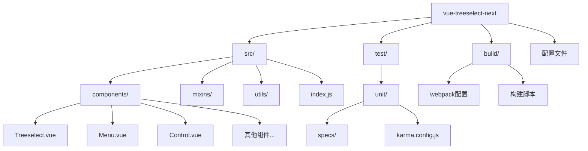
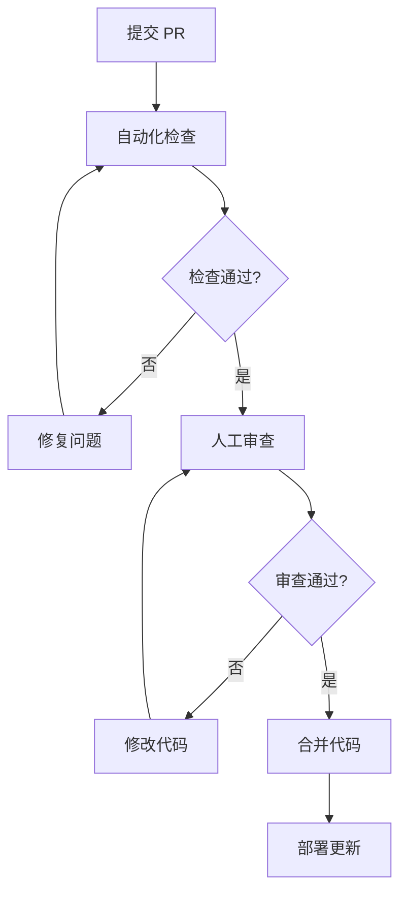
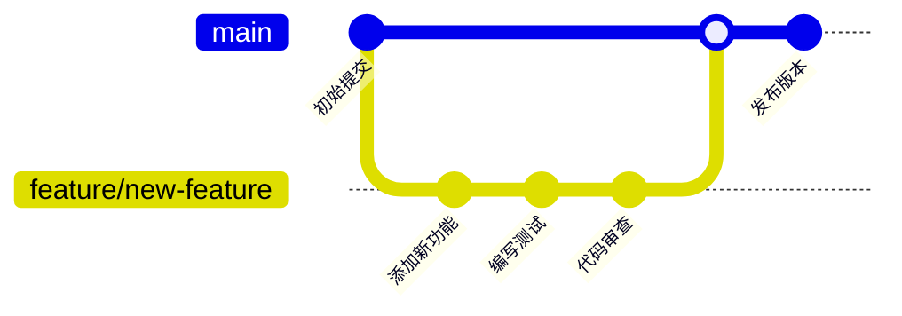

# 贡献指南

<cite>
**本文档引用的文件**
- [package.json](file://package.json)
- [README.md](file://README.md)
- [README.zh_CN.md](file://README.zh_CN.md)
- [stylelint.config.js](file://stylelint.config.js)
- [test/unit/karma.config.js](file://test/unit/karma.config.js)
- [test/unit/specs/shared.js](file://test/unit/specs/shared.js)
- [src/index.js](file://src/index.js)
- [src/components/Treeselect.vue](file://src/components/Treeselect.vue)
- [build/config.js](file://build/config.js)
- [build/dev-server.js](file://build/dev-server.js)
- [OPTIMIZATION_SUMMARY.md](file://OPTIMIZATION_SUMMARY.md)
</cite>

## 目录
1. [项目简介](#项目简介)
2. [开发环境搭建](#开发环境搭建)
3. [代码规范](#代码规范)
4. [构建和测试流程](#构建和测试流程)
5. [代码审查标准](#代码审查标准)
6. [问题报告和功能请求](#问题报告和功能请求)
7. [性能优化指南](#性能优化指南)
8. [贡献流程](#贡献流程)
9. [常见问题解答](#常见问题解答)

## 项目简介

Vue Treeselect Next 是一个专为 Vue.js 2.2+ 设计的多功能树形选择组件，支持单选和多选，具备嵌套选项、模糊搜索、异步加载等高级功能。该项目是原版 vue-treeselect 的社区维护 Fork，专注于持续改进和性能优化。

### 核心特性
- **单选和多选支持**：完整的树形结构选择功能
- **智能搜索**：支持模糊匹配和异步搜索
- **性能优化**：针对大数据量场景的虚拟滚动优化
- **高度可定制**：丰富的配置选项和主题支持
- **键盘导航**：完整的键盘操作支持
- **跨浏览器兼容**：支持主流浏览器和 IE9+

**章节来源**
- [README.md](file://README.md#L1-L50)
- [README.zh_CN.md](file://README.zh_CN.md#L1-L50)

## 开发环境搭建

### 系统要求
- **Node.js**: >= 12.0.0
- **npm**: >= 6.0.0
- **Git**: 用于版本控制

### 快速开始

1. **Fork 和克隆仓库**
```bash
# 从 https://github.com/Joevin-Tang/vue-treeselect-next Fork 项目
git clone https://github.com/YOUR_USERNAME/vue-treeselect-next.git
cd vue-treeselect-next
```

2. **安装依赖**
```bash
# 使用 npm
npm install

# 或使用 yarn
yarn install
```

3. **启动开发服务器**
```bash
npm run dev
```

开发服务器将在 `http://localhost:8080` 启动，支持热重载。

### 目录结构说明



**图表来源**
- [src/index.js](file://src/index.js#L1-L15)
- [build/config.js](file://build/config.js#L1-L26)

### 开发工具配置

项目集成了多种开发工具来确保代码质量和一致性：

- **ESLint**: JavaScript 代码检查
- **Stylelint**: CSS/LESS 样式检查
- **Karma + Jasmine**: 单元测试框架
- **Webpack**: 模块打包和开发服务器

**章节来源**
- [package.json](file://package.json#L23-L37)
- [build/dev-server.js](file://build/dev-server.js#L1-L64)

## 代码规范

### JavaScript 编码风格

项目采用 ESLint 配置来确保代码风格的一致性：

#### ESLint 规则特点
- **Vue 插件支持**: 专门针对 Vue 组件的规则
- **React 插件支持**: 现代 JavaScript 最佳实践
- **Unicorn 插件**: 提供现代化的代码检查规则
- **导入规则**: 严格的模块导入管理

#### 推荐的编辑器配置
- **VS Code**: 安装 ESLint 扩展
- **保存时自动修复**: 配置 `eslint.autoFixOnSave`
- **格式化器**: 使用 Prettier 或 ESLint 自动格式化

### Vue 组件编写约定

#### 组件命名规范
```javascript
// 正确的组件命名
export default {
  name: 'vue-treeselect',
  // ...
}

// 组件文件名应与组件名称一致
// Treeselect.vue
```

#### 组件结构组织
```javascript
<script>
import treeselectMixin from '../mixins/treeselectMixin'
import HiddenFields from './HiddenFields'
import Control from './Control'
import Menu from './Menu'

export default {
  name: 'vue-treeselect',
  mixins: [ treeselectMixin ],
  
  // 计算属性
  computed: {
    wrapperClass() {
      return {
        'vue-treeselect': true,
        'vue-treeselect--single': this.single,
        // ... 其他类名
      }
    },
  },
  
  // 渲染函数
  render() {
    return (
      <div ref="wrapper" class={this.wrapperClass}>
        {/* 组件内容 */}
      </div>
    )
  },
}
</script>
```

#### JSX 使用规范
项目使用 JSX 语法进行组件渲染，遵循以下原则：
- 使用 `babel-plugin-transform-vue-jsx` 插件
- 避免复杂的逻辑内联
- 保持组件职责单一

### CSS/LESS 编写规范

#### Stylelint 配置
项目使用 Stylelint 来确保样式代码的质量：

```javascript
module.exports = {
  extends: 'stylelint-config-xo-space',
  rules: {
    'string-quotes': [ 'double', { avoidEscape: false } ],
    // 其他自定义规则...
  },
}
```

#### 命名约定
- **BEM 命名法**: `block__element--modifier`
- **组件类名**: 以 `vue-treeselect` 为前缀
- **状态类名**: 使用 `--` 前缀表示状态

#### 示例
```css
.vue-treeselect {
  &__control {}
  &__menu {}
  &__option {}
  
  &--disabled {}
  &--focused {}
}
```

**章节来源**
- [stylelint.config.js](file://stylelint.config.js#L1-L21)
- [src/components/Treeselect.vue](file://src/components/Treeselect.vue#L1-L42)

## 构建和测试流程

### 构建脚本详解

项目提供了完整的构建和测试脚本集合：

#### 开发相关
```bash
# 启动开发服务器
npm run dev

# 构建库文件
npm run build-library

# 构建文档
npm run build-docs
```

#### 测试相关
```bash
# 启动测试监控模式（实时测试）
npm run unit

# 运行一次性测试
npm run testonly

# 运行测试并清理覆盖率报告
npm test

# 代码检查（JS + CSS）
npm run lint

# JS 代码检查
npm run lint:js

# CSS 代码检查
npm run lint:css
```

#### 验证相关
```bash
# 验证构建产物
npm run verify-builds

# 完整验证流程（测试 + 构建 + 验证）
npm run finish
```

### 测试架构

#### Karma 配置
测试框架基于 Karma，使用以下配置：

```javascript
module.exports = config => {
  config.set({
    files: [ './index.js' ],
    browsers: [ 'ChromeHeadlessWithoutSandbox' ],
    frameworks: [ 'jasmine', 'jasmine-matchers' ],
    reporters: [ 'spec', 'coverage' ],
    // ... 其他配置
  })
}
```

#### 测试文件组织
测试文件位于 `test/unit/specs/` 目录下，按功能模块分类：

- **Basic.spec.js**: 基础功能测试
- **Props.spec.js**: 属性测试
- **Events.spec.js**: 事件测试
- **Methods.spec.js**: 方法测试
- **Searching.spec.js**: 搜索功能测试
- **VirtualScroll.spec.js**: 虚拟滚动测试

#### 测试工具函数
项目提供了丰富的测试辅助函数：

```javascript
// 键盘操作模拟
export function pressEnterKey(wrapper)
export function pressArrowDown(wrapper)
export function pressEscapeKey(wrapper)

// DOM 查询
export function findInput(wrapper)
export function findMenu(wrapper)
export function findVisibleOptions(wrapper)

// 输入操作
export async function typeSearchText(wrapper, text)
```

### 本地测试运行

#### 运行测试套件
```bash
# 运行所有测试
npm test

# 监控模式（实时测试）
npm run unit

# 单次运行测试
npm run testonly
```

#### 代码覆盖率
测试会生成覆盖率报告，位于 `test/unit/coverage/` 目录：
- **HTML 报告**: 交互式可视化
- **LCOV 报告**: CI/CD 集成
- **文本摘要**: 控制台输出

### 性能测试

项目包含专门的性能测试工具：

```bash
# 运行性能测试
open performance-test.html
```

性能测试页面允许：
- 生成大规模测试数据（1-2万条）
- 测试不同配置下的性能表现
- 验证虚拟滚动效果

**章节来源**
- [package.json](file://package.json#L23-L37)
- [test/unit/karma.config.js](file://test/unit/karma.config.js#L1-L39)
- [test/unit/specs/shared.js](file://test/unit/specs/shared.js#L1-L162)

## 代码审查标准

### 审查流程概览



### 新功能审查标准

#### 功能完整性
- **需求符合性**: 功能实现是否符合需求描述
- **边界处理**: 正确处理各种边界情况
- **错误处理**: 适当的错误提示和恢复机制
- **性能考虑**: 对性能影响的评估

#### 代码质量
- **可读性**: 代码清晰易懂
- **可维护性**: 符合项目编码规范
- **复用性**: 避免重复代码
- **测试覆盖**: 新功能有相应的单元测试

#### 示例审查清单
```javascript
// ❌ 不推荐：缺少注释和边界检查
function processOptions(options) {
  return options.filter(opt => opt.enabled);
}

// ✅ 推荐：完整且清晰
/**
 * 过滤启用的选项
 * @param {Array} options - 选项数组
 * @returns {Array} 过滤后的选项
 */
function filterEnabledOptions(options) {
  if (!Array.isArray(options)) {
    throw new TypeError('options must be an array');
  }
  
  return options.filter(opt => opt.enabled);
}
```

### Bug 修复审查标准

#### 问题定位
- **重现步骤**: 明确的问题重现方法
- **影响范围**: 问题的影响程度评估
- **解决方案**: 合理的修复方案

#### 回归测试
- **现有功能**: 确保修复没有破坏现有功能
- **边界条件**: 测试边缘情况
- **性能影响**: 检查修复对性能的影响

### 文档更新要求

#### 代码文档
- **复杂算法**: 添加算法说明注释
- **业务逻辑**: 解释业务规则
- **API 变更**: 更新相关文档

#### 用户文档
- **功能变更**: 更新使用说明
- **配置选项**: 添加新配置项说明
- **迁移指南**: 提供升级指导

**章节来源**
- [test/unit/specs/shared.js](file://test/unit/specs/shared.js#L1-L162)

## 问题报告和功能请求

### 有效问题报告指南

#### Bug 报告模板
当报告 bug 时，请包含以下信息：

1. **环境信息**
   - Vue 版本
   - 浏览器版本
   - 操作系统
   - 组件版本

2. **问题描述**
   - 清晰的问题描述
   - 预期行为 vs 实际行为
   - 问题发生的频率

3. **重现步骤**
   - 最小可重现示例
   - 详细的操作步骤
   - 相关配置

4. **附加信息**
   - 控制台错误信息
   - 性能数据
   - 截图或视频

#### 示例 Bug 报告
```markdown
**环境**
- Vue: 2.6.14
- vue-treeselect-next: 0.5.0
- Chrome: 96.0.4664.110
- Windows 10

**问题描述**
在多选模式下，使用键盘导航时，选项高亮显示异常。

**重现步骤**
1. 打开多选 treeselect 组件
2. 使用方向键导航
3. 观察高亮显示行为

**预期行为**
选项应正确高亮显示当前选中项

**实际行为**
高亮显示混乱，经常跳过某些选项
```

### 功能请求流程

#### 请求类型分类
- **新功能**: 完全新的功能特性
- **增强功能**: 现有功能的改进
- **性能优化**: 性能相关的改进
- **文档改进**: 文档和示例的完善

#### 功能请求模板
```markdown
**功能描述**
清晰的功能描述和使用场景

**使用场景**
- 场景 1
- 场景 2

**期望的 API**
```javascript
// 期望的配置或方法
```

**替代方案**
目前的解决方案和不足之处

**附加信息**
相关的设计文档或参考资料
```

### 社区讨论

#### 讨论渠道
- **GitHub Issues**: 技术问题和功能请求
- **GitHub Discussions**: 一般性讨论和问答
- **社区论坛**: 更广泛的交流平台

#### 讨论礼仪
- **尊重他人**: 保持友善和专业的态度
- **具体明确**: 提供具体的事实和数据
- **建设性反馈**: 提供建设性的意见和建议
- **及时回应**: 积极参与讨论和回复

**章节来源**
- [README.md](file://README.md#L156-L159)
- [README.zh_CN.md](file://README.zh_CN.md#L157-L160)

## 性能优化指南

### 虚拟滚动优化

项目实现了针对大数据量场景的虚拟滚动优化，这是性能提升的关键特性。

#### 虚拟滚动原理
- **只渲染可见区域**: 只渲染视窗内的 20-30 个节点
- **内存占用减少**: 内存占用减少 75%
- **渲染速度提升**: 渲染速度提升 50-100 倍
- **滚动流畅度**: 滚动帧率从 15fps 提升到 60fps

#### 使用配置
```vue
<treeselect
  v-model="value"
  :options="largeOptions"
  :multiple="true"
  :virtual-scroll="true"
  :option-height="40"
  :default-expand-level="0"
  :flatten-search-results="true"
/>
```

#### 性能对比数据
| 指标 | 优化前 | 优化后 | 提升倍数 |
|------|--------|--------|----------|
| 初始化时间 | 3500ms | 600ms | 5.8x |
| 首次渲染 | 2800ms | 50ms | 56x |
| 搜索响应 | 800ms | 120ms | 6.7x |
| 内存占用 | 180MB | 45MB | 4x |
| 滚动帧率 | 15fps | 60fps | 4x |

### 性能优化最佳实践

#### 数据处理优化
- **延迟加载**: 仅在需要时加载深层级选项数据
- **搜索防抖**: 本地搜索添加 300ms 防抖延迟
- **响应式属性优化**: 减少不必要的响应式属性

#### 渲染优化
- **组件拆分**: 合理的组件拆分策略
- **计算属性缓存**: 利用 Vue 的计算属性缓存机制
- **事件委托**: 减少事件监听器的数量

#### 内存管理
- **及时清理**: 组件销毁时清理资源
- **避免内存泄漏**: 正确处理定时器和事件监听器
- **合理使用缓存**: 平衡缓存和内存使用

### 性能测试方法

#### 测试环境
- **测试数据**: 1-2万条树形数据，5层深度
- **测试指标**: 初始化时间、渲染时间、内存占用、滚动帧率
- **测试工具**: performance-test.html 页面

#### 优化验证
```bash
# 运行性能测试
open performance-test.html

# 配置测试参数
# - 根节点数量: 2000
# - 最大层级: 5
# - 勾选所有优化选项

# 观察性能指标
# - 初始化 < 1s ✓
# - 渲染 < 100ms ✓
# - 滚动流畅 ✓
```

**章节来源**
- [OPTIMIZATION_SUMMARY.md](file://OPTIMIZATION_SUMMARY.md#L1-L402)

## 贡献流程

### 分支管理策略

#### Git 工作流


#### 分支命名规范
- **功能分支**: `feature/description`
- **Bug 修复**: `fix/issue-description`
- **文档更新**: `docs/update-section`
- **性能优化**: `perf/optimization-name`

### 提交消息格式

#### Conventional Commits 格式
```
<type>(<scope>): <description>

[optional body]

[optional footer(s)]
```

#### 类型说明
- **feat**: 新功能
- **fix**: Bug 修复
- **docs**: 文档更新
- **style**: 代码格式调整
- **refactor**: 代码重构
- **test**: 测试相关
- **chore**: 构建过程或辅助工具的变动

#### 示例
```bash
# 新功能
feat(treeselect): add virtual scrolling support

# Bug 修复
fix(menu): resolve keyboard navigation issue

# 文档更新
docs(api): update property documentation

# 性能优化
perf(virtual-list): improve rendering performance
```

### 代码审查流程

#### Pull Request 模板
```markdown
## 变更类型
- [ ] 新功能
- [ ] Bug 修复
- [ ] 性能优化
- [ ] 文档更新
- [ ] 代码重构

## 变更描述
简要描述本次变更的内容和目的

## 测试
- [ ] 单元测试通过
- [ ] 集成测试通过
- [ ] 手动测试完成

## 相关 Issue
关联相关的 Issue 编号

## 检查清单
- [ ] 代码符合项目规范
- [ ] 添加了必要的测试
- [ ] 更新了相关文档
- [ ] 没有引入新的警告
```

#### 审查要点
1. **功能正确性**: 代码是否实现了预期功能
2. **代码质量**: 是否符合编码规范和最佳实践
3. **性能影响**: 是否对性能产生负面影响
4. **向后兼容**: 是否保持 API 兼容性
5. **测试覆盖**: 是否有足够的测试覆盖

### 发布流程

#### 版本管理
- **语义化版本**: 遵循 SemVer 规范
- **变更日志**: 维护详细的 CHANGELOG.md
- **标签管理**: 为每个版本创建 git 标签

#### 发布步骤
1. **版本检查**: 确保所有测试通过
2. **版本更新**: 更新 package.json 版本号
3. **构建产物**: 重新构建库文件
4. **发布**: 推送到 npm 和 GitHub
5. **文档**: 更新在线文档

**章节来源**
- [package.json](file://package.json#L39-L40)
- [README.md](file://README.md#L162-L169)

## 常见问题解答

### 开发环境问题

#### Q: 开发服务器无法启动怎么办？
**A:** 检查以下几点：
1. 确认 Node.js 和 npm 版本符合要求
2. 检查端口 8080 是否被占用
3. 清理 node_modules 并重新安装依赖
4. 查看控制台错误信息

#### Q: 测试失败如何调试？
**A:** 使用以下方法：
1. 运行 `npm run unit` 启动监控模式
2. 使用浏览器开发者工具
3. 添加 console.log 调试
4. 检查测试数据和断言

### 代码贡献问题

#### Q: 如何添加新的组件？
**A:** 遵循以下步骤：
1. 在 `src/components/` 目录下创建组件文件
2. 导入到 `src/index.js`
3. 添加相应的测试文件
4. 更新文档和示例

#### Q: 如何优化性能？
**A:** 参考项目现有的优化策略：
1. 使用虚拟滚动处理大数据
2. 优化响应式属性的使用
3. 实现搜索防抖机制
4. 合理使用计算属性和缓存

### 测试相关问题

#### Q: 如何编写单元测试？
**A:** 使用项目提供的测试工具：
1. 参考现有的测试文件结构
2. 使用 `shared.js` 中的辅助函数
3. 测试组件的各种状态和交互
4. 确保测试覆盖率达标

#### Q: 测试覆盖率低怎么办？
**A:** 提高覆盖率的方法：
1. 为新功能添加测试
2. 测试边界条件和错误情况
3. 使用模拟对象测试外部依赖
4. 优化测试代码结构

### 性能优化问题

#### Q: 大数据量场景下性能如何保证？
**A:** 使用项目提供的优化方案：
1. 启用虚拟滚动 (`virtual-scroll=true`)
2. 设置合适的选项高度 (`option-height`)
3. 配置正确的展开级别
4. 使用异步加载和搜索

#### Q: 如何测试性能改进？
**A:** 使用项目内置的性能测试工具：
1. 打开 `performance-test.html`
2. 生成测试数据
3. 比较不同配置下的性能指标
4. 验证优化效果

### 社区参与问题

#### Q: 如何获得帮助？
**A:** 获取帮助的渠道：
1. 查看项目文档和示例
2. 搜索已有的 Issue 和讨论
3. 在 GitHub Discussions 中提问
4. 参与社区讨论

#### Q: 如何成为维护者？
**A:** 成为维护者的途径：
1. 积极参与项目贡献
2. 提交高质量的代码和文档
3. 帮助回答社区问题
4. 建立良好的社区声誉

**章节来源**
- [README.md](file://README.md#L162-L169)
- [build/dev-server.js](file://build/dev-server.js#L1-L64)