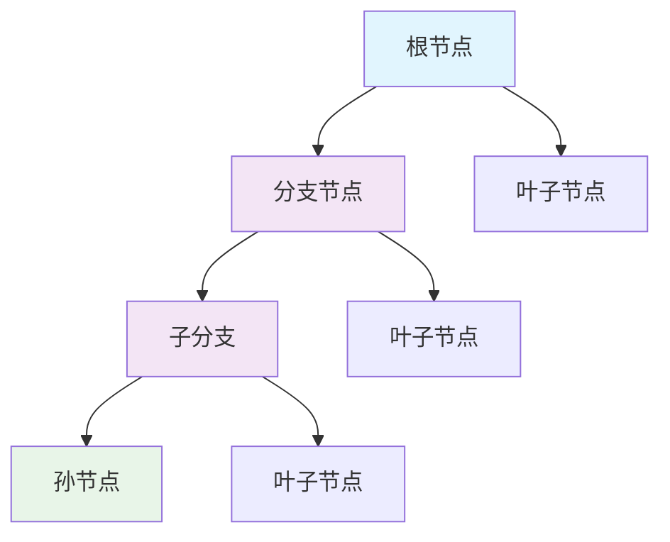
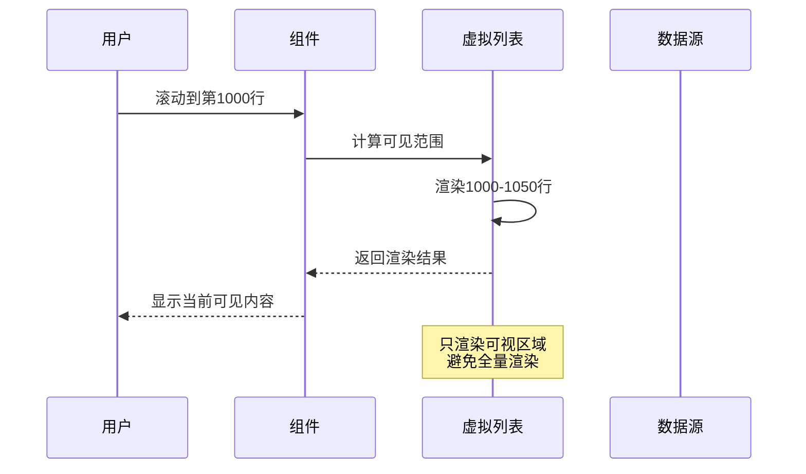
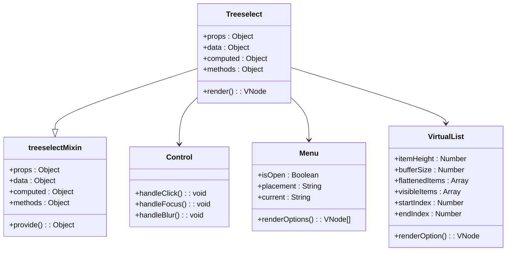
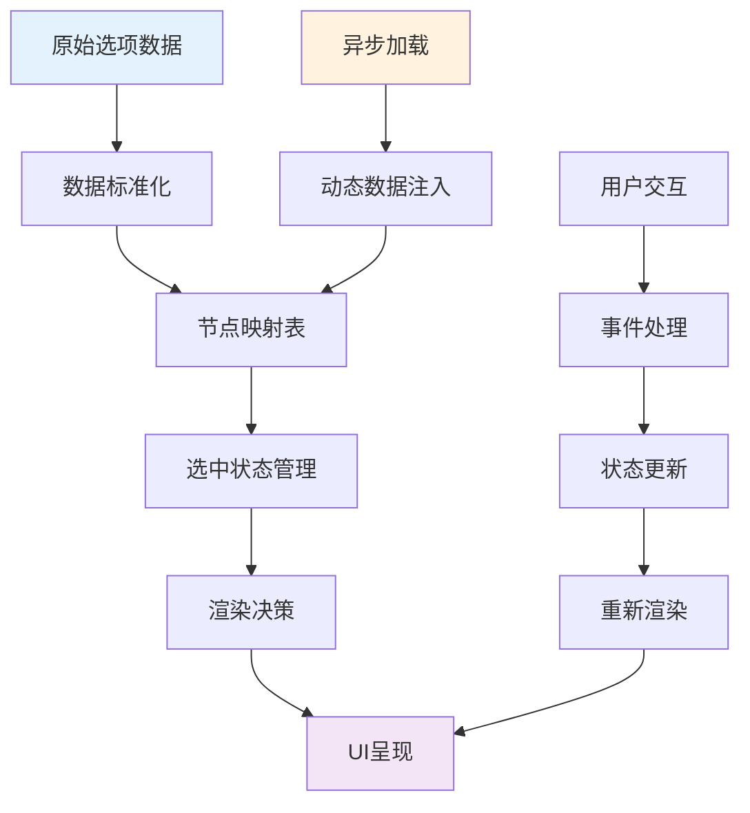
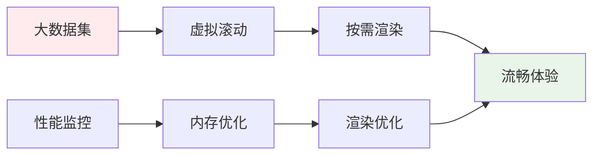
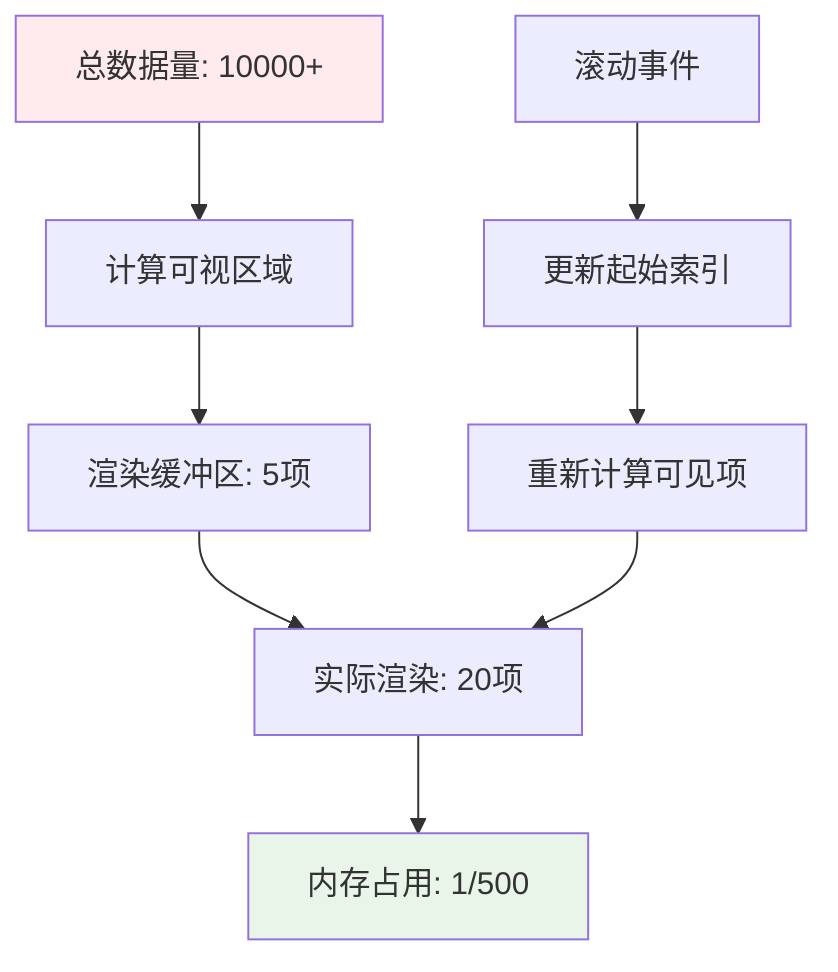
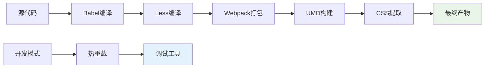

# 项目概述

<cite>
**本文档中引用的文件**
- [README.md](file://README.md)
- [package.json](file://package.json)
- [src/index.js](file://src/index.js)
- [src/components/Treeselect.vue](file://src/components/Treeselect.vue)
- [src/mixins/treeselectMixin.js](file://src/mixins/treeselectMixin.js)
- [src/components/VirtualList.vue](file://src/components/VirtualList.vue)
- [src/examples/LargeDataExample.vue](file://src/examples/LargeDataExample.vue)
- [src/constants.js](file://src/constants.js)
- [src/utils/debounce.js](file://src/utils/debounce.js)
- [src/utils/find.js](file://src/utils/find.js)
</cite>

## 目录
1. [项目简介](#项目简介)
2. [核心特性](#核心特性)
3. [技术架构](#技术架构)
4. [设计哲学](#设计哲学)
5. [目标用户群体](#目标用户群体)
6. [浏览器兼容性](#浏览器兼容性)
7. [应用场景](#应用场景)
8. [性能优化](#性能优化)
9. [开发环境](#开发环境)
10. [总结](#总结)

## 项目简介

vue-treeselect-next是一个专为Vue.js生态系统设计的高级树形选择组件，作为原版vue-treeselect的社区维护分支，致力于提供强大而灵活的层级数据选择解决方案。该项目由Joevin维护，继承了原作者Riophae Lee的优秀设计理念，并持续进行功能增强和性能优化。

### 项目背景

vue-treeselect-next是在原项目不再积极维护的情况下诞生的，旨在继续为开发者提供高质量的树形选择器组件。项目采用Vue 2.2+作为基础框架，充分利用现代JavaScript特性和Vue.js的响应式系统，构建了一个功能完备、性能优异的树形选择组件。

**章节来源**
- [README.md](file://README.md#L1-L20)
- [package.json](file://package.json#L1-L10)

## 核心特性

### 嵌套选项支持

组件的核心优势在于其强大的嵌套选项支持能力，能够处理任意深度的树形结构数据。通过标准化的数据格式，开发者可以轻松构建复杂的层级选择界面。

**图表来源**
- [src/mixins/treeselectMixin.js](file://src/mixins/treeselectMixin.js#L475-L480)

### 模糊搜索功能

内置的模糊搜索算法支持快速查找树形结构中的节点，即使面对大量数据也能保持出色的响应性能。搜索功能支持多字段匹配和自定义匹配规则。

### 异步加载机制

组件提供了完整的异步加载解决方案，支持延迟加载深层级选项，有效减少初始加载时间和内存占用。这种按需加载策略特别适合处理大规模树形数据。

### 虚拟滚动优化

针对大数据量场景，组件实现了高效的虚拟滚动技术，只渲染可视区域内的节点，确保在处理数千甚至上万条数据时仍能保持流畅的用户体验。

**图表来源**
- [src/components/VirtualList.vue](file://src/components/VirtualList.vue#L85-L105)

### 键盘导航支持

完整的键盘操作支持，包括方向键导航、回车选中、ESC退出等功能，为用户提供无障碍的交互体验。

### 多种选择模式

支持单选、多选和平铺模式等多种选择方式，满足不同业务场景的需求。

**章节来源**
- [README.md](file://README.md#L23-L35)
- [src/mixins/treeselectMixin.js](file://src/mixins/treeselectMixin.js#L657-L800)

## 技术架构

### 组件结构

vue-treeselect-next采用模块化的组件架构，主要包含以下核心组件：

**图表来源**
- [src/components/Treeselect.vue](file://src/components/Treeselect.vue#L1-L42)
- [src/mixins/treeselectMixin.js](file://src/mixins/treeselectMixin.js#L64-L71)

### 状态管理

组件采用Vue.js的响应式系统进行状态管理，主要状态包括：

| 状态类型 | 描述 | 关键属性 |
|---------|------|----------|
| 触发器状态 | 控制组件焦点和搜索状态 | `trigger.isFocused`, `trigger.searchQuery` |
| 菜单状态 | 管理下拉菜单的开启关闭和位置 | `menu.isOpen`, `menu.current`, `menu.placement` |
| 森林状态 | 存储所有选项的标准化数据和选中状态 | `forest.normalizedOptions`, `forest.selectedNodeIds` |
| 搜索状态 | 处理本地和远程搜索逻辑 | `localSearch.active`, `remoteSearch` |

### 数据流设计

**图表来源**
- [src/mixins/treeselectMixin.js](file://src/mixins/treeselectMixin.js#L658-L707)

**章节来源**
- [src/components/Treeselect.vue](file://src/components/Treeselect.vue#L1-L42)
- [src/mixins/treeselectMixin.js](file://src/mixins/treeselectMixin.js#L64-L100)

## 设计哲学

### 用户体验优先

组件设计始终以提升用户体验为目标，通过以下原则指导开发：

1. **渐进式增强**：从基本功能开始，逐步添加高级特性
2. **一致性原则**：保持与Vue.js生态系统的一致性
3. **可访问性**：内置键盘导航和屏幕阅读器支持
4. **性能第一**：在功能丰富的同时保证最佳性能

### 可扩展性设计

组件采用高度模块化的设计，允许开发者根据需求定制功能：

- **插槽系统**：支持自定义选项渲染
- **事件系统**：提供丰富的生命周期事件
- **配置选项**：灵活的属性配置机制

### 最佳实践遵循

项目严格遵循Vue.js的最佳实践：

- 使用Composition API风格的混入模式
- 实现响应式数据绑定
- 采用函数式编程思想处理数据转换
- 提供完善的TypeScript类型定义

**章节来源**
- [src/index.js](file://src/index.js#L1-L15)
- [src/constants.js](file://src/constants.js#L1-L51)

## 目标用户群体

### 主要用户

1. **前端开发者**：需要在Vue.js项目中实现复杂层级选择功能
2. **企业应用开发者**：构建管理系统、权限控制等需要树形结构的应用
3. **数据分析师**：需要筛选和选择大量分类数据的场景
4. **系统管理员**：负责配置和管理具有层级结构的系统参数

### 使用场景

- **权限管理**：角色权限的树形分配
- **分类管理**：商品分类、文章分类等层级结构管理
- **组织架构**：公司部门、职位的树形展示
- **配置管理**：系统参数的层级配置
- **数据筛选**：多维度数据的选择和过滤

**章节来源**
- [README.md](file://README.md#L34-L35)

## 浏览器兼容性

vue-treeselect-next支持广泛的浏览器环境：

### 支持的浏览器

| 浏览器 | 版本要求 | 兼容性状态 |
|--------|----------|------------|
| Chrome | 最新版本 | 完全支持 |
| Firefox | 最新版本 | 完全支持 |
| Safari | 最新版本 | 完全支持 |
| Edge | 最新版本 | 完全支持 |
| Internet Explorer | ≥ 9 | 基本支持 |

### 兼容性考虑

对于IE9浏览器，虽然功能完整可用，但由于CSS特性支持限制，部分样式效果可能略有差异。项目团队确保在IE9上的核心功能正常运行，同时提供优雅降级方案。

**章节来源**
- [README.md](file://README.md#L146-L154)

## 应用场景

### 大数据量处理

对于包含数千甚至上万条数据的树形结构，组件提供了专门的优化方案：

**图表来源**
- [src/examples/LargeDataExample.vue](file://src/examples/LargeDataExample.vue#L1-L50)

### 实时搜索场景

支持实时搜索和过滤功能，适用于：

- 商品搜索和分类筛选
- 文档内容检索
- 用户权限查找
- 系统配置项搜索

### 动态数据加载

支持异步加载和动态更新，适合：

- 分级数据加载
- 权限树动态生成
- 地域信息分层展示

**章节来源**
- [src/examples/LargeDataExample.vue](file://src/examples/LargeDataExample.vue#L20-L40)

## 性能优化

### 虚拟滚动技术

组件实现了先进的虚拟滚动算法，显著提升大数据量场景下的性能：

**图表来源**
- [src/components/VirtualList.vue](file://src/components/VirtualList.vue#L22-L25)

### 搜索性能优化

- **防抖处理**：搜索输入自动添加300ms防抖
- **缓存机制**：启用选项缓存减少重复计算
- **智能匹配**：支持模糊搜索和精确匹配切换

### 内存管理

- **懒加载**：只加载可见的节点数据
- **对象池**：重用DOM元素和数据对象
- **及时清理**：组件销毁时自动清理资源

### 渲染优化

- **批量更新**：合并多个状态变更
- **虚拟DOM**：利用Vue.js的高效diff算法
- **条件渲染**：只渲染必要的UI元素

**章节来源**
- [src/components/VirtualList.vue](file://src/components/VirtualList.vue#L1-L217)
- [src/utils/debounce.js](file://src/utils/debounce.js#L1-L2)

## 开发环境

### 项目依赖

vue-treeselect-next基于现代前端技术栈构建：

#### 核心依赖
- **Vue.js 2.2+**：基础框架
- **Babel**：JavaScript编译器
- **Webpack**：模块打包工具
- **Less**：CSS预处理器

#### 工具链
- **ESLint**：代码质量检查
- **Karma + Jasmine**：单元测试
- **Stylelint**：CSS代码规范
- **Size Limit**：包大小监控

### 构建流程

### 开发指南

项目提供了完整的开发环境配置和构建脚本：

- **开发服务器**：`npm run dev`
- **单元测试**：`npm run test`
- **构建生产包**：`npm run build-library`
- **代码检查**：`npm run lint`

**章节来源**
- [package.json](file://package.json#L23-L37)

## 总结

vue-treeselect-next作为一个成熟的Vue.js树形选择组件，成功地继承和发展了原版vue-treeselect的优势，同时在性能、功能和易用性方面都有显著提升。项目的核心价值体现在：

### 技术优势

1. **高性能**：通过虚拟滚动和智能缓存实现大数据量场景下的流畅体验
2. **功能完整**：涵盖树形选择的所有核心需求和高级特性
3. **易于集成**：简洁的API设计和完善的文档支持
4. **持续维护**：活跃的社区维护和定期的功能更新

### 应用价值

对于需要处理复杂层级数据选择的前端开发者来说，vue-treeselect-next提供了专业级的解决方案，能够显著提升开发效率和用户体验。无论是简单的分类选择还是复杂的企业级权限管理，该组件都能提供稳定可靠的支持。

### 发展前景

随着Vue.js生态系统的不断发展，vue-treeselect-next将继续演进，为开发者提供更加完善和高效的树形选择解决方案。项目的开源性质和社区驱动的发展模式，确保了其能够持续适应新的技术趋势和用户需求。