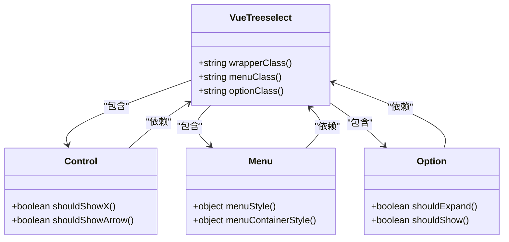

# 主题定制

<cite>
**本文档中引用的文件**   
- [Treeselect.vue](file://src/components/Treeselect.vue)
- [Control.vue](file://src/components/Control.vue)
- [Menu.vue](file://src/components/Menu.vue)
- [Option.vue](file://src/components/Option.vue)
- [style.less](file://src/style.less)
- [treeselectMixin.js](file://src/mixins/treeselectMixin.js)
- [LargeDataExample.vue](file://src/examples/LargeDataExample.vue)
</cite>

## 目录
1. [简介](#简介)
2. [CSS变量覆盖](#css变量覆盖)
3. [深度选择器穿透scoped样式](#深度选择器穿透scoped样式)
4. [BEM命名规范与类名定制](#bem命名规范与类名定制)
5. [视觉属性定制](#视觉属性定制)
6. [与主流UI框架集成](#与主流ui框架集成)
7. [性能友好的样式覆盖策略](#性能友好的样式覆盖策略)
8. [完整CSS定制示例](#完整css定制示例)

## 简介
vue-treeselect-next 是一个支持嵌套选项的多选组件，提供了丰富的主题定制能力。通过CSS变量、深度选择器和BEM命名规范，开发者可以灵活地修改组件的视觉样式，包括控件高度、菜单背景色、选项行高、边框圆角等属性，同时保持与主流UI框架（如Element UI、Ant Design Vue）的风格统一。

**Section sources**
- [Treeselect.vue](file://src/components/Treeselect.vue#L1-L42)
- [style.less](file://src/style.less#L1-L1148)

## CSS变量覆盖
组件的样式系统基于Less变量定义，允许通过覆盖这些变量来实现主题定制。主要的CSS变量定义在`src/style.less`文件中，涵盖了字体大小、内边距、边框半径、颜色等各个方面。

```less
@treeselect-font-size: 1em;
@treeselect-padding: 5px;
@treeselect-border-radius-lg: 5px;
@treeselect-control-height: 36px;
@treeselect-control-border-color: #ddd;
@treeselect-control-bg: #fff;
@treeselect-menu-bg: #fff;
@treeselect-arrow-color: #ccc;
```

通过在项目中重新定义这些变量，可以在编译时覆盖默认样式，实现全局主题定制。

**Section sources**
- [style.less](file://src/style.less#L12-L115)

## 深度选择器穿透scoped样式
当在使用scoped样式的Vue组件中使用vue-treeselect时，可以使用`::v-deep`深度选择器来穿透scoped样式限制，直接修改组件内部的样式。

```css
.my-component {
  ::v-deep .vue-treeselect {
    width: 300px;
    
    &__control {
      height: 40px;
      border-color: #1890ff;
      border-radius: 4px;
    }
    
    &__menu {
      border-color: #1890ff;
      border-radius: 4px;
    }
    
    &__option--highlight {
      background-color: #e6f7ff;
    }
  }
}
```

这种方法允许在不修改组件源码的情况下，精确控制组件的内部样式。

**Section sources**
- [LargeDataExample.vue](file://src/examples/LargeDataExample.vue#L134-L213)

## BEM命名规范与类名定制
组件采用BEM（Block Element Modifier）命名规范，生成具有语义化的CSS类名，便于理解和定制。主要的类名结构如下：

- **Block（块）**: `vue-treeselect` - 组件的根元素
- **Element（元素）**: `vue-treeselect__control`, `vue-treeselect__menu`, `vue-treeselect__option` - 组件的子元素
- **Modifier（修饰符）**: `vue-treeselect--single`, `vue-treeselect--focused`, `vue-treeselect--open` - 表示组件状态的修饰类

组件根据不同的状态动态添加相应的类名，例如：
- `vue-treeselect--single`: 单选模式
- `vue-treeselect--multi`: 多选模式
- `vue-treeselect--focused`: 控件获得焦点
- `vue-treeselect--open`: 菜单打开
- `vue-treeselect--disabled`: 控件禁用



**Diagram sources **
- [Treeselect.vue](file://src/components/Treeselect.vue#L12-L28)
- [Control.vue](file://src/components/Control.vue#L18-L40)
- [Menu.vue](file://src/components/Menu.vue#L26-L36)
- [Option.vue](file://src/components/Option.vue#L21-L31)

**Section sources**
- [Treeselect.vue](file://src/components/Treeselect.vue#L12-L28)
- [Control.vue](file://src/components/Control.vue#L18-L40)
- [Menu.vue](file://src/components/Menu.vue#L26-L36)
- [Option.vue](file://src/components/Option.vue#L21-L31)

## 视觉属性定制
通过覆盖CSS变量或直接修改CSS类名，可以定制组件的各种视觉属性。

### 控件高度
通过修改`@treeselect-control-height`变量或直接设置`.vue-treeselect__control`的高度来调整控件高度。

```less
@treeselect-control-height: 40px;
```

### 菜单背景色
通过修改`@treeselect-menu-bg`变量或直接设置`.vue-treeselect__menu`的背景色来调整菜单背景色。

```less
@treeselect-menu-bg: #f5f5f5;
```

### 选项行高
通过修改`@treeselect-menu-line-height`变量或直接设置`.vue-treeselect__menu`的行高来调整选项行高。

```less
@treeselect-menu-line-height: 1.8;
```

### 边框圆角
通过修改`@treeselect-control-border-radius`变量或直接设置`.vue-treeselect__control`的边框半径来调整边框圆角。

```less
@treeselect-control-border-radius: 8px;
```

**Section sources**
- [style.less](file://src/style.less#L24-L31)
- [style.less](file://src/style.less#L67-L69)
- [style.less](file://src/style.less#L15-L16)
- [style.less](file://src/style.less#L31-L31)

## 与主流UI框架集成
为了在项目中保持风格统一，可以将vue-treeselect的样式与主流UI框架（如Element UI、Ant Design Vue）进行集成。

### 与Element UI集成
```css
/* 使用Element UI的主题色 */
::v-deep .vue-treeselect {
  &__control {
    border-color: #dcdfe6;
    border-radius: 4px;
    
    &:hover {
      border-color: #c0c4cc;
    }
    
    &.vue-treeselect--focused {
      border-color: #409eff;
      box-shadow: 0 0 0 3px rgba(64, 158, 255, 0.2);
    }
  }
  
  &__option--highlight {
    background-color: #f5f7fa;
  }
  
  &__option--selected {
    background-color: #ecf5ff;
    color: #409eff;
  }
}
```

### 与Ant Design Vue集成
```css
/* 使用Ant Design Vue的主题色 */
::v-deep .vue-treeselect {
  &__control {
    border-color: #d9d9d9;
    border-radius: 4px;
    
    &:hover {
      border-color: #40a9ff;
    }
    
    &.vue-treeselect--focused {
      border-color: #40a9ff;
      box-shadow: 0 0 0 2px rgba(24, 144, 255, 0.2);
    }
  }
  
  &__option--highlight {
    background-color: #f5f5f5;
  }
  
  &__option--selected {
    background-color: #e6f7ff;
    color: #1890ff;
  }
}
```

**Section sources**
- [LargeDataExample.vue](file://src/examples/LargeDataExample.vue#L134-L213)

## 性能友好的样式覆盖策略
为了避免全局样式污染并确保性能，建议采用以下策略：

1. **使用CSS变量**: 在编译时覆盖变量，避免运行时的样式重计算
2. **局部作用域**: 使用scoped样式和深度选择器，限制样式作用范围
3. **精确选择器**: 避免使用过于宽泛的选择器，减少样式匹配开销
4. **避免!important**: 尽量不使用!important，保持样式优先级的清晰

```css
/* 推荐：精确且局部的作用域 */
.my-component ::v-deep .vue-treeselect__control {
  height: 40px;
}

/* 不推荐：全局且强制覆盖 */
.vue-treeselect__control {
  height: 40px !important;
}
```

**Section sources**
- [LargeDataExample.vue](file://src/examples/LargeDataExample.vue#L134-L213)

## 完整CSS定制示例
以下是一个完整的CSS定制示例，展示了如何集成到项目中：

```css
/* 自定义主题样式 */
.custom-treeselect {
  /* 使用深度选择器穿透scoped样式 */
  ::v-deep {
    /* 根组件 */
    .vue-treeselect {
      font-family: -apple-system, BlinkMacSystemFont, 'Segoe UI', Roboto, sans-serif;
      
      /* 控件样式 */
      &__control {
        height: 44px;
        border-width: 2px;
        border-color: #1890ff;
        border-radius: 8px;
        transition: all 0.3s ease;
        
        &:hover {
          border-color: #40a9ff;
        }
        
        &.vue-treeselect--focused {
          border-color: #1890ff;
          box-shadow: 0 0 0 4px rgba(24, 144, 255, 0.1);
        }
      }
      
      /* 菜单样式 */
      &__menu {
        border-width: 2px;
        border-color: #1890ff;
        border-radius: 8px;
        box-shadow: 0 4px 12px rgba(0, 0, 0, 0.15);
      }
      
      /* 选项样式 */
      &__option {
        padding: 12px 16px;
        
        &--highlight {
          background-color: #e6f7ff;
        }
        
        &--selected {
          background-color: #bae7ff;
          font-weight: 600;
        }
      }
      
      /* 多选值样式 */
      &__multi-value-item {
        background-color: #e6f7ff;
        border-color: #91d5ff;
        border-radius: 20px;
        color: #1890ff;
        
        &:hover {
          background-color: #bae7ff;
        }
      }
      
      /* 箭头样式 */
      &__control-arrow {
        color: #1890ff;
        
        &:hover {
          color: #40a9ff;
        }
      }
    }
  }
}
```

**Section sources**
- [LargeDataExample.vue](file://src/examples/LargeDataExample.vue#L134-L213)