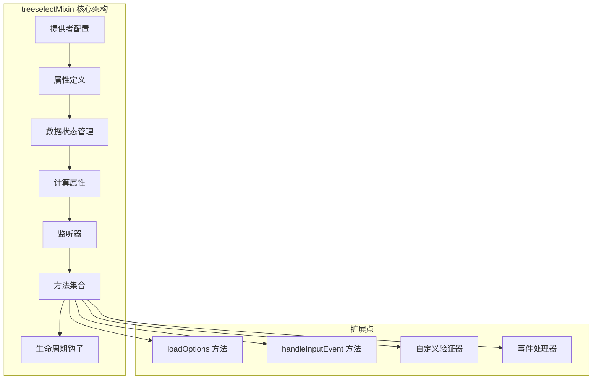
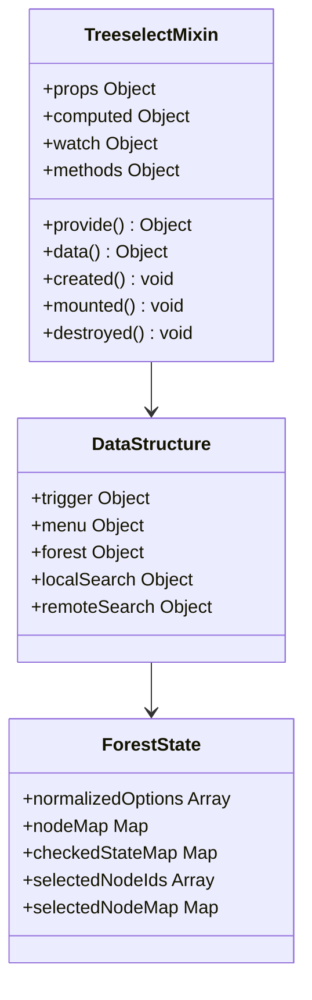
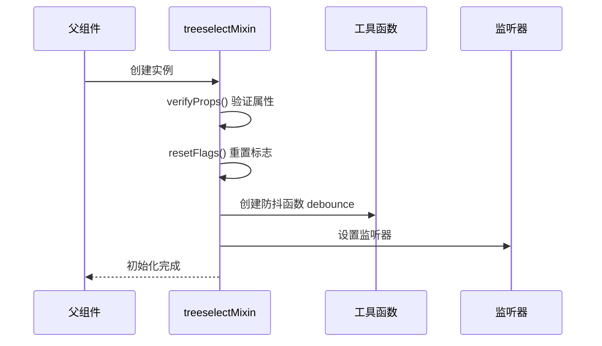
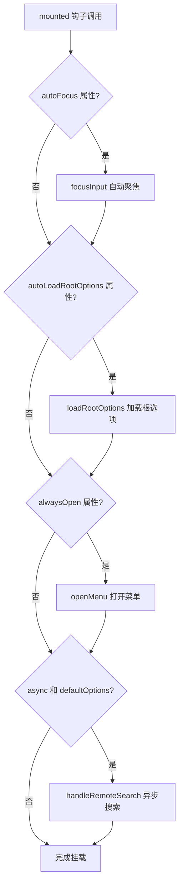
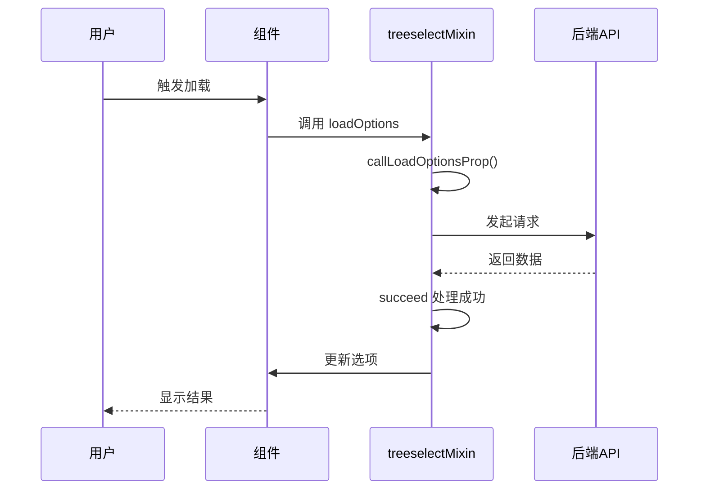
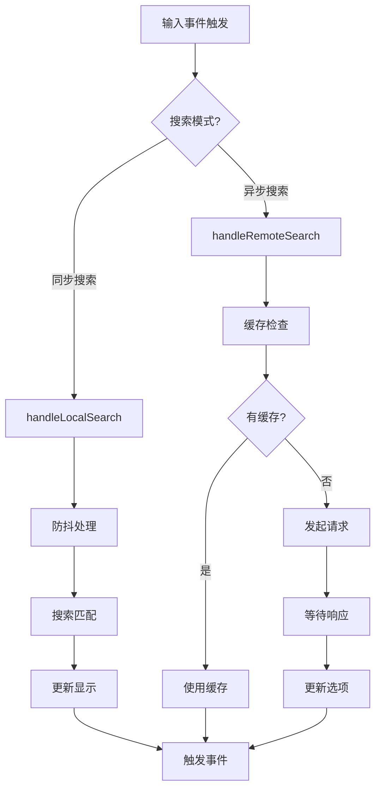
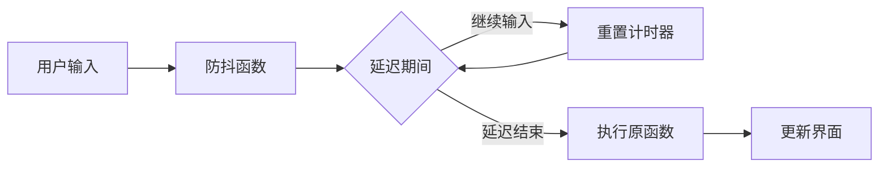
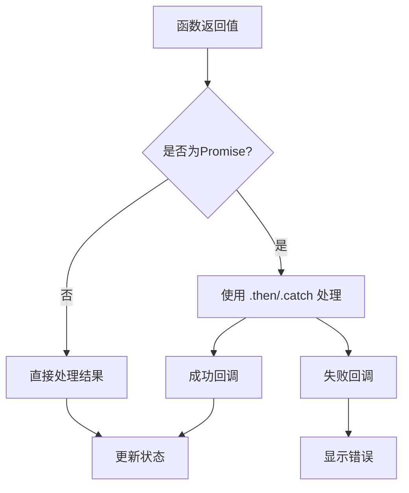

# 扩展开发

<cite>
**本文档中引用的文件**
- [treeselectMixin.js](file://src/mixins/treeselectMixin.js)
- [Treeselect.vue](file://src/components/Treeselect.vue)
- [index.js](file://src/index.js)
- [debounce.js](file://src/utils/debounce.js)
- [isPromise.js](file://src/utils/isPromise.js)
- [constants.js](file://src/constants.js)
- [utils/index.js](file://src/utils/index.js)
- [README.md](file://README.md)
</cite>

## 目录
1. [概述](#概述)
2. [mixin 架构设计](#mixin-架构设计)
3. [生命周期钩子注入](#生命周期钩子注入)
4. [核心方法扩展](#核心方法扩展)
5. [工具函数使用](#工具函数使用)
6. [实际扩展示例](#实际扩展示例)
7. [最佳实践](#最佳实践)
8. [故障排除指南](#故障排除指南)

## 概述

vue-treeselect-next 提供了一个强大的 mixin 系统，允许开发者通过继承和扩展 treeselectMixin 来实现自定义行为逻辑。本指南将详细介绍如何安全地重写或增强现有方法，创建子类组件以添加新功能，并提供实际的代码示例。

## mixin 架构设计

### 核心架构概览

treeselectMixin 采用模块化设计，将功能分为多个逻辑区域：



**图表来源**
- [treeselectMixin.js](file://src/mixins/treeselectMixin.js#L64-L1984)

### 数据结构设计

mixin 使用分层的数据结构来管理组件状态：



**图表来源**
- [treeselectMixin.js](file://src/mixins/treeselectMixin.js#L658-L706)

**章节来源**
- [treeselectMixin.js](file://src/mixins/treeselectMixin.js#L64-L1984)

## 生命周期钩子注入

### 创建阶段注入

在 `created` 钩子中，mixin 执行初始化操作：



**图表来源**
- [treeselectMixin.js](file://src/mixins/treeselectMixin.js#L1965-L1970)

### 挂载阶段注入

`mounted` 钩子负责执行挂载后的初始化：



**图表来源**
- [treeselectMixin.js](file://src/mixins/treeselectMixin.js#L1972-L1977)

**章节来源**
- [treeselectMixin.js](file://src/mixins/treeselectMixin.js#L1965-L1982)

## 核心方法扩展

### loadOptions 方法扩展

`loadOptions` 是 mixin 中最重要的扩展点之一，支持异步数据加载：



**图表来源**
- [treeselectMixin.js](file://src/mixins/treeselectMixin.js#L1672-L1766)

### handleInputEvent 方法扩展

输入事件处理是用户交互的核心：



**图表来源**
- [treeselectMixin.js](file://src/mixins/treeselectMixin.js#L880-L892)

### 方法重写策略

扩展 mixin 方法时应遵循以下原则：

1. **保持向后兼容性**：始终调用父类方法
2. **使用装饰器模式**：在方法前后添加自定义逻辑
3. **参数验证**：确保传入参数的有效性
4. **错误处理**：妥善处理异常情况

**章节来源**
- [treeselectMixin.js](file://src/mixins/treeselectMixin.js#L1672-L1766)
- [treeselectMixin.js](file://src/mixins/treeselectMixin.js#L1217-L1319)

## 工具函数使用

### 防抖函数 (debounce)

防抖函数用于优化频繁触发的操作：



**图表来源**
- [debounce.js](file://src/utils/debounce.js#L1-L2)

### Promise 检测 (isPromise)

Promise 检测用于处理异步操作：



**图表来源**
- [isPromise.js](file://src/utils/isPromise.js#L1-L2)

### 常用工具函数

| 函数名 | 用途 | 使用场景 |
|--------|------|----------|
| `debounce` | 防抖处理 | 输入搜索、滚动事件 |
| `isPromise` | Promise检测 | 异步操作处理 |
| `once` | 单次执行 | 回调函数包装 |
| `warning` | 警告提示 | 开发时错误提醒 |
| `createMap` | 对象映射 | 快速查找优化 |
| `find` | 数组查找 | 元素定位 |
| `includes` | 包含检查 | 条件判断 |

**章节来源**
- [utils/index.js](file://src/utils/index.js#L1-L39)
- [debounce.js](file://src/utils/debounce.js#L1-L2)
- [isPromise.js](file://src/utils/isPromise.js#L1-L2)

## 实际扩展示例

### 示例 1：添加日志记录的扩展组件

```javascript
// LoggableTreeselect.js
import { treeselectMixin } from '@joevin/vue-treeselect-next'

export default {
  name: 'LoggableTreeselect',
  mixins: [treeselectMixin],
  
  methods: {
    // 扩展 loadOptions 方法以添加日志
    loadRootOptions() {
      console.log('[LOG] 正在加载根选项...')
      return this.callLoadOptionsProp({
        action: LOAD_ROOT_OPTIONS,
        isPending: () => this.rootOptionsStates.isLoading,
        start: () => {
          console.log('[LOG] 开始加载根选项')
          this.rootOptionsStates.isLoading = true
        },
        succeed: (result) => {
          console.log('[LOG] 根选项加载成功:', result.length, '个选项')
          this.rootOptionsStates.isLoaded = true
        },
        fail: (err) => {
          console.error('[LOG] 根选项加载失败:', err.message)
          this.rootOptionsStates.loadingError = err.message
        },
        end: () => {
          console.log('[LOG] 根选项加载完成')
          this.rootOptionsStates.isLoading = false
        }
      })
    },
    
    // 扩展 select 方法以记录选择操作
    select(node) {
      console.log('[LOG] 选择节点:', {
        id: node.id,
        label: node.label,
        timestamp: new Date().toISOString()
      })
      
      // 调用父类方法
      return this._super('select', node)
    }
  },
  
  created() {
    // 调用父类 created 方法
    this._super('created')
    
    console.log('[LOG] LoggableTreeselect 实例已创建')
  }
}
```

### 示例 2：权限验证扩展

```javascript
// PermissionTreeselect.js
import { treeselectMixin } from '@joevin/vue-treeselect-next'

export default {
  name: 'PermissionTreeselect',
  mixins: [treeselectMixin],
  
  props: {
    requiredPermissions: {
      type: Array,
      default: () => []
    }
  },
  
  methods: {
    // 扩展 getNode 方法以添加权限检查
    getNode(nodeId) {
      const node = this._super('getNode', nodeId)
      
      if (node && this.requiredPermissions.length > 0) {
        // 检查当前用户是否有访问权限
        const hasPermission = this.checkUserPermission(node)
        
        if (!hasPermission) {
          console.warn(`[PERMISSION] 用户无权访问节点: ${node.label}`)
          node.isDisabled = true
        }
      }
      
      return node
    },
    
    // 新增权限检查方法
    checkUserPermission(node) {
      // 实现具体的权限检查逻辑
      // 这里可以调用 Vuex store 或 API 获取用户权限
      return this.userHasPermission(node.id)
    },
    
    // 扩展 select 方法以验证权限
    select(node) {
      if (node.isDisabled) {
        console.warn(`[PERMISSION] 尝试选择被禁用的节点: ${node.label}`)
        return
      }
      
      return this._super('select', node)
    }
  }
}
```

### 示例 3：数据预处理扩展

```javascript
// PreprocessTreeselect.js
import { treeselectMixin } from '@joevin/vue-treeselect-next'

export default {
  name: 'PreprocessTreeselect',
  mixins: [treeselectMixin],
  
  methods: {
    // 扩展 normalize 方法以预处理数据
    normalize(parentNode, nodes, prevNodeMap) {
      // 在标准化之前预处理数据
      const processedNodes = this.preprocessOptions(nodes)
      
      // 调用父类方法进行标准化
      const normalized = this._super('normalize', parentNode, processedNodes, prevNodeMap)
      
      // 在标准化后添加额外信息
      this.postprocessNormalizedOptions(normalized)
      
      return normalized
    },
    
    // 数据预处理
    preprocessOptions(options) {
      return options.map(option => {
        // 添加额外的元数据
        return {
          ...option,
          _processed: true,
          _timestamp: Date.now(),
          _level: this.calculateDepth(option)
        }
      })
    },
    
    // 数据后处理
    postprocessNormalizedOptions(normalizedOptions) {
      normalizedOptions.forEach(option => {
        // 添加计算属性
        Object.defineProperty(option, 'fullPath', {
          get: () => this.getNodeFullPath(option)
        })
        
        // 添加格式化方法
        Object.defineProperty(option, 'formattedLabel', {
          get: () => this.formatNodeLabel(option)
        })
      })
    },
    
    // 计算节点深度
    calculateDepth(node, depth = 0) {
      if (node.children && node.children.length > 0) {
        return Math.max(...node.children.map(child => 
          this.calculateDepth(child, depth + 1)
        ))
      }
      return depth
    },
    
    // 获取节点完整路径
    getNodeFullPath(node) {
      const path = []
      let current = node
      
      while (current) {
        path.unshift(current.label)
        current = current.parentNode
      }
      
      return path.join(' > ')
    },
    
    // 格式化节点标签
    formatNodeLabel(node) {
      const prefix = this.getIndentPrefix(node.level)
      return `${prefix}${node.label}`
    },
    
    getIndentPrefix(level) {
      return ' '.repeat(level * 2)
    }
  }
}
```

### Vue.extend 扩展示例

```javascript
// 使用 Vue.extend 创建扩展组件
import Vue from 'vue'
import { treeselectMixin } from '@joevin/vue-treeselect-next'

const EnhancedTreeselect = Vue.extend({
  name: 'EnhancedTreeselect',
  mixins: [treeselectMixin],
  
  data() {
    return {
      // 自定义数据
      auditTrail: [],
      performanceMetrics: {
        loadTime: 0,
        searchCount: 0,
        selectionCount: 0
      }
    }
  },
  
  methods: {
    // 性能监控
    trackLoadTime() {
      const startTime = performance.now()
      
      return (callback) => {
        const endTime = performance.now()
        this.performanceMetrics.loadTime = endTime - startTime
        
        if (typeof callback === 'function') {
          callback(endTime - startTime)
        }
      }
    },
    
    // 审计跟踪
    logSelection(node, action) {
      this.auditTrail.push({
        action,
        nodeId: node.id,
        timestamp: new Date().toISOString(),
        userId: this.getCurrentUser().id,
        duration: this.performanceMetrics.loadTime
      })
    },
    
    // 扩展 select 方法
    select(node) {
      this.performanceMetrics.selectionCount++
      this.logSelection(node, 'SELECT')
      
      return this._super('select', node)
    },
    
    // 扩展 loadRootOptions 方法
    loadRootOptions() {
      const track = this.trackLoadTime()
      
      return this.callLoadOptionsProp({
        action: LOAD_ROOT_OPTIONS,
        isPending: () => this.rootOptionsStates.isLoading,
        start: () => {
          this.rootOptionsStates.isLoading = true
          console.log('[PERFORMANCE] 开始加载选项...')
        },
        succeed: (result) => {
          track()
          this.rootOptionsStates.isLoaded = true
          console.log(`[PERFORMANCE] 加载完成，耗时: ${this.performanceMetrics.loadTime.toFixed(2)}ms`)
        },
        fail: (err) => {
          track()
          this.rootOptionsStates.loadingError = err.message
          console.error('[PERFORMANCE] 加载失败:', err)
        },
        end: () => {
          this.rootOptionsStates.isLoading = false
        }
      })
    }
  },
  
  // 计算属性
  computed: {
    performanceReport() {
      return {
        totalLoadTime: this.performanceMetrics.loadTime,
        selectionRate: this.performanceMetrics.selectionCount / 
                      (this.performanceMetrics.searchCount || 1),
        efficiency: this.performanceMetrics.loadTime / 
                   (this.performanceMetrics.searchCount + 1)
      }
    }
  }
})

export default EnhancedTreeselect
```

**章节来源**
- [treeselectMixin.js](file://src/mixins/treeselectMixin.js#L1672-L1766)
- [Treeselect.vue](file://src/components/Treeselect.vue#L1-L42)

## 最佳实践

### 1. 方法重写规范

```javascript
// 推荐的做法
methods: {
  select(node) {
    // 1. 参数验证
    if (!node || this.disabled || node.isDisabled) {
      return
    }
    
    // 2. 自定义前置逻辑
    this.beforeSelect(node)
    
    // 3. 调用父类方法
    const result = this._super('select', node)
    
    // 4. 自定义后置逻辑
    this.afterSelect(node)
    
    return result
  }
}
```

### 2. 状态管理最佳实践

```javascript
// 使用响应式数据管理扩展状态
data() {
  return {
    // 扩展的状态
    customState: {
      isInitialized: false,
      loadingCount: 0,
      errorCount: 0
    },
    
    // 缓存机制
    optionCache: new Map(),
    
    // 配置选项
    config: {
      enableLogging: true,
      maxCacheSize: 100,
      cacheTimeout: 300000 // 5分钟
    }
  }
}
```

### 3. 错误处理策略

```javascript
// 统一的错误处理
methods: {
  safeCall(methodName, ...args) {
    try {
      return this[methodName](...args)
    } catch (error) {
      console.error(`[EXTENSION ERROR] 调用 ${methodName} 失败:`, error)
      this.handleError(error, methodName)
      return null
    }
  },
  
  handleError(error, context) {
    // 发送错误报告
    this.reportError(error, context)
    
    // 显示用户友好的错误消息
    this.showErrorNotification(error.message)
    
    // 更新错误统计
    this.customState.errorCount++
  }
}
```

### 4. 性能优化建议

```javascript
// 使用防抖和节流优化性能
data() {
  return {
    // 防抖函数缓存
    debouncedMethods: {}
  }
}

methods: {
  // 动态创建防抖函数
  createDebouncedMethod(methodName, delay = 300) {
    if (!this.debouncedMethods[methodName]) {
      this.debouncedMethods[methodName] = debounce(() => {
        this[methodName]()
      }, delay)
    }
    
    return this.debouncedMethods[methodName]
  },
  
  // 使用缓存优化重复计算
  getCachedResult(key, computeFn) {
    if (!this.optionCache.has(key)) {
      this.optionCache.set(key, computeFn())
      
      // 清理过期缓存
      if (this.optionCache.size > this.config.maxCacheSize) {
        const firstKey = this.optionCache.keys().next().value
        this.optionCache.delete(firstKey)
      }
    }
    
    return this.optionCache.get(key)
  }
}
```

### 5. 类型安全和文档

```javascript
// 使用 JSDoc 提供类型信息
/**
 * 扩展的 select 方法
 * @param {Object} node - 要选择的节点
 * @param {string} node.id - 节点ID
 * @param {string} node.label - 节点标签
 * @returns {boolean} 是否成功选择
 */
methods: {
  select(node) {
    // 类型检查
    if (typeof node !== 'object' || !node.id) {
      throw new TypeError('node 参数必须是包含 id 属性的对象')
    }
    
    // 实现逻辑...
  }
}
```

## 故障排除指南

### 常见问题及解决方案

#### 1. 方法调用失败

**问题**：扩展方法中调用 `_super` 失败

**解决方案**：
```javascript
// 确保正确实现 _super 方法
_super(methodName, ...args) {
  if (!this.constructor.super) {
    throw new Error('未找到父类构造函数')
  }
  
  const method = this.constructor.super.methods[methodName]
  if (typeof method !== 'function') {
    throw new Error(`父类没有名为 ${methodName} 的方法`)
  }
  
  return method.apply(this, args)
}
```

#### 2. 状态不一致

**问题**：扩展组件与原始组件状态不同步

**解决方案**：
```javascript
// 使用正确的初始化顺序
created() {
  // 1. 调用父类初始化
  this._super('created')
  
  // 2. 执行扩展初始化
  this.initializeCustomFeatures()
  
  // 3. 设置监听器
  this.setupCustomWatchers()
}
```

#### 3. 内存泄漏

**问题**：扩展组件导致内存泄漏

**解决方案**：
```javascript
// 确保清理资源
beforeDestroy() {
  // 清理定时器
  if (this.timer) {
    clearTimeout(this.timer)
    this.timer = null
  }
  
  // 清理事件监听器
  if (this.eventListener) {
    document.removeEventListener('click', this.eventListener)
    this.eventListener = null
  }
  
  // 清理缓存
  this.optionCache.clear()
  
  // 调用父类清理
  this._super('beforeDestroy')
}
```

#### 4. 性能问题

**问题**：扩展组件性能下降

**诊断步骤**：
```javascript
// 添加性能监控
methods: {
  measurePerformance(methodName) {
    const start = performance.now()
    const result = this[methodName]()
    const end = performance.now()
    
    console.log(`${methodName} 耗时: ${end - start}ms`)
    
    return result
  }
}
```

**优化策略**：
- 使用防抖和节流
- 实现智能缓存
- 避免不必要的重新渲染
- 使用虚拟滚动处理大数据集

### 调试技巧

#### 1. 日志记录

```javascript
// 添加详细的日志
methods: {
  debugLog(message, data = {}) {
    if (this.config.enableLogging) {
      console.log(`[DEBUG] ${message}`, {
        timestamp: new Date().toISOString(),
        ...data
      })
    }
  }
}
```

#### 2. 状态快照

```javascript
// 创建状态快照
methods: {
  createSnapshot() {
    return {
      timestamp: Date.now(),
      state: JSON.parse(JSON.stringify({
        options: this.forest.normalizedOptions,
        selected: this.internalValue,
        search: this.trigger.searchQuery
      }))
    }
  }
}
```

#### 3. 单元测试

```javascript
// 测试扩展方法
describe('扩展功能测试', () => {
  let wrapper
  
  beforeEach(() => {
    wrapper = mount(EnhancedTreeselect, {
      propsData: {
        options: testData
      }
    })
  })
  
  it('应该正确处理选择操作', () => {
    const node = wrapper.vm.forest.nodeMap[testNodeId]
    wrapper.vm.select(node)
    
    expect(wrapper.vm.internalValue).toContain(testNodeId)
    expect(wrapper.vm.auditTrail.length).toBeGreaterThan(0)
  })
})
```

**章节来源**
- [treeselectMixin.js](file://src/mixins/treeselectMixin.js#L1965-L1982)

## 结论

通过深入理解 treeselectMixin 的架构设计和扩展机制，开发者可以创建功能丰富、性能优异的自定义树形选择组件。关键要点包括：

1. **理解 mixin 架构**：掌握 treeselectMixin 的模块化设计和数据流
2. **安全的方法扩展**：遵循最佳实践，确保向后兼容性
3. **合理使用工具函数**：充分利用提供的工具函数提升开发效率
4. **性能优化**：注意内存管理和性能监控
5. **错误处理**：建立完善的错误处理和调试机制

通过这些指导原则和实际示例，开发者可以充分发挥 vue-treeselect-next 的扩展能力，构建满足特定业务需求的高质量组件。