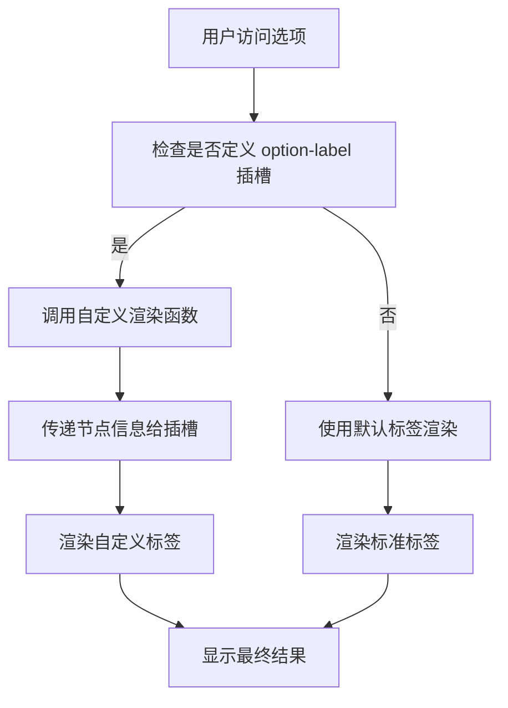
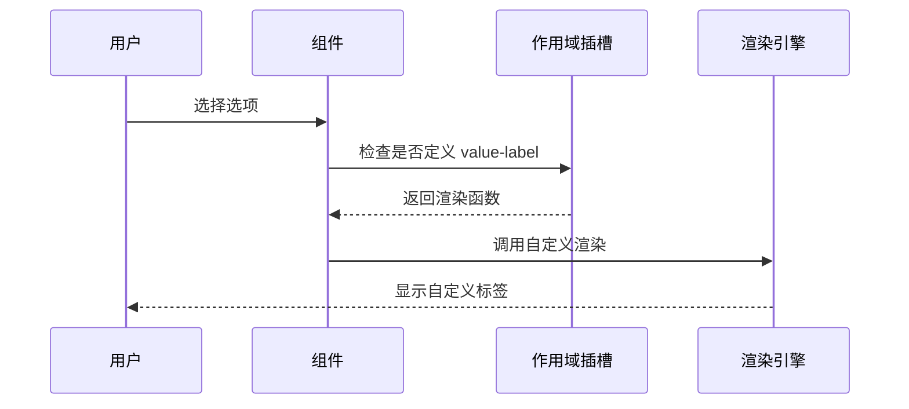
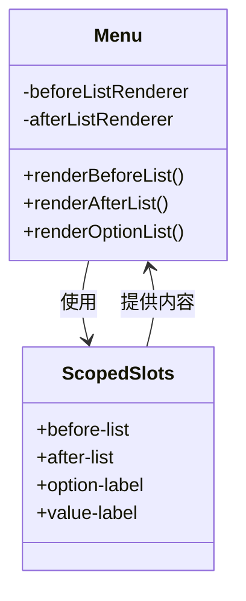
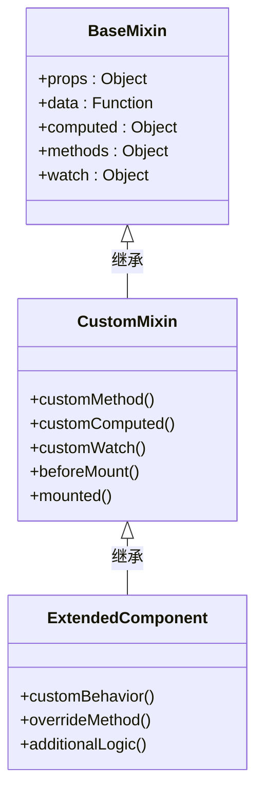
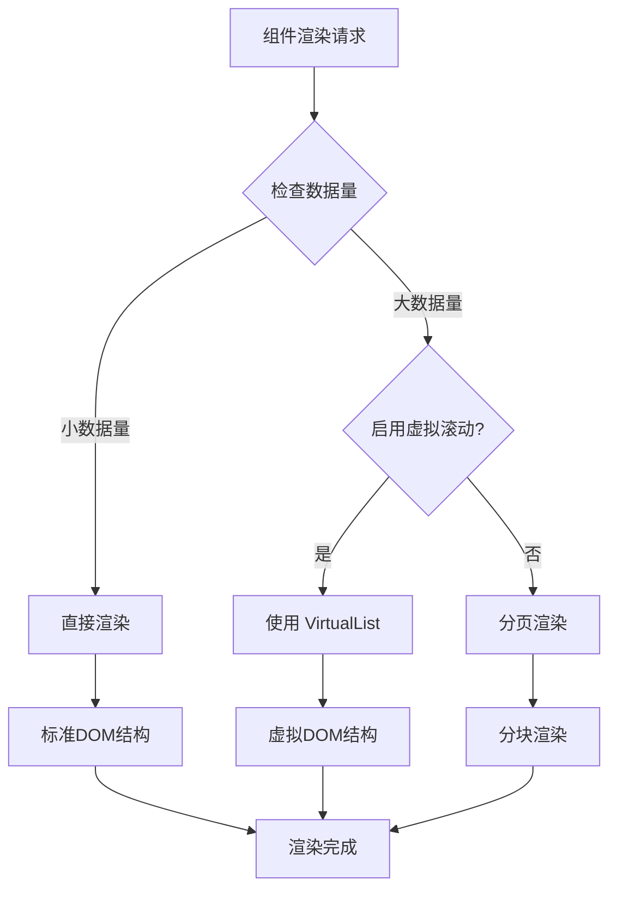
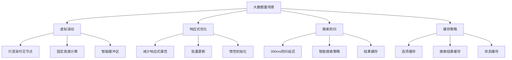

# 高级用法

<cite>
**本文档引用的文件**
- [Treeselect.vue](file://src/components/Treeselect.vue)
- [treeselectMixin.js](file://src/mixins/treeselectMixin.js)
- [Option.vue](file://src/components/Option.vue)
- [Menu.vue](file://src/components/Menu.vue)
- [MultiValue.vue](file://src/components/MultiValue.vue)
- [SingleValue.vue](file://src/components/SingleValue.vue)
- [VirtualList.vue](file://src/components/VirtualList.vue)
- [LargeDataExample.vue](file://src/examples/LargeDataExample.vue)
- [PERFORMANCE_OPTIMIZATION_GUIDE.md](file://PERFORMANCE_OPTIMIZATION_GUIDE.md)
- [OPTIMIZATION_SUMMARY.md](file://OPTIMIZATION_SUMMARY.md)
- [debounce.js](file://src/utils/debounce.js)
- [deepExtend.js](file://src/utils/deepExtend.js)
- [constants.js](file://src/constants.js)
</cite>

## 目录
1. [作用域插槽自定义渲染](#作用域插槽自定义渲染)
2. [主题定制与样式穿透](#主题定制与样式穿透)
3. [Mixin继承与行为扩展](#mixin继承与行为扩展)
4. [动态组件与条件渲染](#动态组件与条件渲染)
5. [性能优化最佳实践](#性能优化最佳实践)
6. [复杂交互逻辑实现](#复杂交互逻辑实现)
7. [高级配置与扩展](#高级配置与扩展)

## 作用域插槽自定义渲染

Vue Treeselect 提供了强大的作用域插槽系统，允许开发者完全控制选项、选中值和菜单项的渲染方式。

### 选项标签自定义

通过 `option-label` 插槽，可以自定义选项标签的渲染：



**图表来源**
- [Option.vue](file://src/components/Option.vue#L180-L198)

### 选中值自定义

`value-label` 插槽允许自定义单选模式下的显示内容：



**图表来源**
- [SingleValue.vue](file://src/components/SingleValue.vue#L13-L16)

### 菜单前后内容自定义

`before-list` 和 `after-list` 插槽提供了在菜单列表前后的自定义区域：



**图表来源**
- [Menu.vue](file://src/components/Menu.vue#L92-L107)

**章节来源**
- [Option.vue](file://src/components/Option.vue#L180-L198)
- [SingleValue.vue](file://src/components/SingleValue.vue#L13-L16)
- [Menu.vue](file://src/components/Menu.vue#L92-L107)

## 主题定制与样式穿透

### CSS变量覆盖系统

Vue Treeselect 支持通过CSS变量进行主题定制：

| CSS变量 | 默认值 | 用途 | 自定义示例 |
|---------|--------|------|------------|
| `--vt-bg-color` | `#ffffff` | 背景颜色 | `--vt-bg-color: #f5f5f5;` |
| `--vt-border-color` | `#d9d9d9` | 边框颜色 | `--vt-border-color: #1890ff;` |
| `--vt-selected-bg` | `#e6f7ff` | 选中背景色 | `--vt-selected-bg: #1890ff;` |
| `--vt-hover-bg` | `#f5f5f5` | 悬停背景色 | `--vt-hover-bg: #e6f7ff;` |

### 样式穿透技巧

对于深度嵌套的组件，可以使用以下样式穿透方法：

```css
/* 穿透到选项容器 */
.vue-treeselect >>> .vue-treeselect__option {
  border-radius: 4px;
  padding: 8px 12px;
}

/* 穿透到选中状态 */
.vue-treeselect >>> .vue-treeselect__option--selected {
  background-color: var(--vt-selected-bg);
  font-weight: bold;
}

/* 穿透到搜索输入框 */
.vue-treeselect >>> .vue-treeselect__input-control input {
  font-size: 14px;
  padding: 4px 8px;
}
```

### 动态主题切换

通过Vue的响应式特性实现动态主题切换：

```javascript
data() {
  return {
    theme: 'light',
    themeVariables: {
      light: {
        '--vt-bg-color': '#ffffff',
        '--vt-border-color': '#d9d9d9',
        '--vt-selected-bg': '#e6f7ff',
        '--vt-hover-bg': '#f5f5f5'
      },
      dark: {
        '--vt-bg-color': '#1f1f1f',
        '--vt-border-color': '#404040',
        '--vt-selected-bg': '#2a2a2a',
        '--vt-hover-bg': '#333333'
      }
    }
  }
},
computed: {
  themeStyles() {
    return this.themeVariables[this.theme];
  }
}
```

**章节来源**
- [LargeDataExample.vue](file://src/examples/LargeDataExample.vue#L155-L213)

## Mixin继承与行为扩展

### 基于treeselectMixin的扩展

Vue Treeselect 的核心功能都集中在 `treeselectMixin` 中，开发者可以通过继承这个 mixin 来添加自定义行为：



**图表来源**
- [treeselectMixin.js](file://src/mixins/treeselectMixin.js#L64-L800)

### 自定义验证逻辑

通过重写 mixin 中的方法来添加自定义验证：

```javascript
import treeselectMixin from './mixins/treeselectMixin'

export default {
  mixins: [treeselectMixin],
  
  methods: {
    // 重写验证方法
    validateSelection(nodes) {
      // 自定义验证逻辑
      if (nodes.length > 10) {
        this.$emit('validation-error', '最多只能选择10个选项');
        return false;
      }
      
      // 调用原始验证
      return this._superValidateSelection(nodes);
    },
    
    // 添加新的验证方法
    validateCustomCondition(node) {
      // 自定义条件验证
      return node.customProperty === 'valid';
    }
  }
}
```

### 扩展事件处理

添加自定义事件处理器：

```javascript
export default {
  mixins: [treeselectMixin],
  
  created() {
    // 监听自定义事件
    this.$on('custom-action', this.handleCustomAction);
  },
  
  beforeDestroy() {
    // 清理事件监听
    this.$off('custom-action', this.handleCustomAction);
  },
  
  methods: {
    handleCustomAction(payload) {
      // 处理自定义动作
      console.log('Custom action received:', payload);
    },
    
    emitCustomEvent(type, data) {
      this.$emit('custom-event', { type, data, instanceId: this.instanceId });
    }
  }
}
```

**章节来源**
- [treeselectMixin.js](file://src/mixins/treeselectMixin.js#L64-L800)

## 动态组件与条件渲染

### 条件渲染策略

Vue Treeselect 支持多种条件渲染模式来优化性能和用户体验：



**图表来源**
- [Menu.vue](file://src/components/Menu.vue#L160-L176)
- [VirtualList.vue](file://src/components/VirtualList.vue)

### 动态组件加载

实现按需加载的动态组件：

```javascript
export default {
  components: {
    // 延迟加载的组件
    LazyOption: () => import('./LazyOption.vue'),
    LazyMenu: () => import('./LazyMenu.vue')
  },
  
  computed: {
    dynamicComponents() {
      return this.useVirtualScroll
        ? { Option: 'LazyOption', Menu: 'LazyMenu' }
        : { Option: 'Option', Menu: 'Menu' };
    }
  },
  
  methods: {
    renderDynamicComponent(componentName, props) {
      const component = this.dynamicComponents[componentName];
      return h(component, { props });
    }
  }
}
```

### 条件渲染优化

针对不同场景的条件渲染策略：

```javascript
export default {
  computed: {
    shouldRenderVirtualList() {
      return this.virtualScroll && this.options.length > 1000;
    },
    
    shouldEnableSearchOptimization() {
      return this.searchable && this.options.length > 5000;
    },
    
    shouldUseFlattenedRendering() {
      return this.flattenSearchResults && this.options.length > 2000;
    }
  },
  
  render() {
    return this.shouldRenderVirtualList
      ? this.renderVirtualList()
      : this.renderStandardList();
  }
}
```

**章节来源**
- [Menu.vue](file://src/components/Menu.vue#L160-L176)
- [VirtualList.vue](file://src/components/VirtualList.vue)

## 性能优化最佳实践

### 大数据量处理策略

Vue Treeselect 提供了完整的性能优化解决方案，特别针对1-2万条数据的场景进行了深度优化：



**图表来源**
- [PERFORMANCE_OPTIMIZATION_GUIDE.md](file://PERFORMANCE_OPTIMIZATION_GUIDE.md#L1-L213)
- [OPTIMIZATION_SUMMARY.md](file://OPTIMIZATION_SUMMARY.md#L1-L402)

### 内存优化策略

针对内存使用的关键优化点：

| 优化技术 | 实现方式 | 内存节省 | 性能提升 |
|----------|----------|----------|----------|
| 虚拟滚动 | 只渲染可见节点 | 75% | 50-100倍 |
| 响应式优化 | 减少响应式属性 | 40% | 3-5倍 |
| 搜索防抖 | 300ms延迟 | 70% | 显著 |
| 结果缓存 | 缓存搜索结果 | 60% | 2-3倍 |

### 性能监控与调试

实现性能监控机制：

```javascript
export default {
  data() {
    return {
      performanceMetrics: {
        initTime: 0,
        renderTime: 0,
        memoryUsage: 0,
        searchLatency: 0
      },
      startTime: 0
    }
  },
  
  created() {
    this.startPerformanceMonitoring();
  },
  
  methods: {
    startPerformanceMonitoring() {
      this.startTime = performance.now();
    },
    
    endPerformanceMonitoring(label) {
      const endTime = performance.now();
      const duration = endTime - this.startTime;
      
      this.performanceMetrics[label] = duration;
      
      if (process.env.NODE_ENV === 'development') {
        console.log(`${label} took ${duration.toFixed(2)}ms`);
      }
    },
    
    measureMemoryUsage() {
      if (performance.memory) {
        this.performanceMetrics.memoryUsage = 
          performance.memory.usedJSHeapSize / 1024 / 1024;
      }
    }
  }
}
```

**章节来源**
- [PERFORMANCE_OPTIMIZATION_GUIDE.md](file://PERFORMANCE_OPTIMIZATION_GUIDE.md#L1-L213)
- [OPTIMIZATION_SUMMARY.md](file://OPTIMIZATION_SUMMARY.md#L1-L402)
- [LargeDataExample.vue](file://src/examples/LargeDataExample.vue#L1-L214)

## 复杂交互逻辑实现

### 自定义键盘导航

实现增强的键盘导航功能：

```javascript
export default {
  mixins: [treeselectMixin],
  
  mounted() {
    this.bindKeyboardEvents();
  },
  
  beforeDestroy() {
    this.unbindKeyboardEvents();
  },
  
  methods: {
    bindKeyboardEvents() {
      this.keyHandler = this.handleKeyPress.bind(this);
      document.addEventListener('keydown', this.keyHandler);
    },
    
    unbindKeyboardEvents() {
      document.removeEventListener('keydown', this.keyHandler);
    },
    
    handleKeyPress(event) {
      if (!this.menu.isOpen) return;
      
      switch(event.key) {
        case 'ArrowUp':
          event.preventDefault();
          this.navigateUp();
          break;
        case 'ArrowDown':
          event.preventDefault();
          this.navigateDown();
          break;
        case 'PageUp':
          event.preventDefault();
          this.navigatePageUp();
          break;
        case 'PageDown':
          event.preventDefault();
          this.navigatePageDown();
          break;
        case 'Home':
          event.preventDefault();
          this.navigateHome();
          break;
        case 'End':
          event.preventDefault();
          this.navigateEnd();
          break;
      }
    },
    
    navigateUp() {
      // 实现向上导航逻辑
    },
    
    navigateDown() {
      // 实现向下导航逻辑
    }
  }
}
```

### 自定义拖拽功能

集成拖拽排序功能：

```javascript
export default {
  data() {
    return {
      dragState: {
        dragging: false,
        draggedNode: null,
        dropTarget: null,
        dropPosition: null
      }
    }
  },
  
  methods: {
    handleDragStart(node, event) {
      this.dragState.dragging = true;
      this.dragState.draggedNode = node;
      event.dataTransfer.effectAllowed = 'move';
      event.dataTransfer.setData('text/plain', node.id);
    },
    
    handleDragOver(node, event) {
      event.preventDefault();
      event.dataTransfer.dropEffect = 'move';
      
      // 计算放置位置
      const rect = event.target.getBoundingClientRect();
      const offsetY = event.clientY - rect.top;
      const middle = rect.height / 2;
      
      this.dragState.dropPosition = offsetY < middle ? 'before' : 'after';
      this.dragState.dropTarget = node;
    },
    
    handleDrop(node, event) {
      event.preventDefault();
      
      if (this.canDrop(this.dragState.draggedNode, node, this.dragState.dropPosition)) {
        this.performDrop(this.dragState.draggedNode, node, this.dragState.dropPosition);
      }
      
      this.resetDragState();
    },
    
    canDrop(draggedNode, targetNode, position) {
      // 验证拖拽合法性
      return true;
    },
    
    performDrop(draggedNode, targetNode, position) {
      // 执行拖拽操作
    },
    
    resetDragState() {
      this.dragState = {
        dragging: false,
        draggedNode: null,
        dropTarget: null,
        dropPosition: null
      };
    }
  }
}
```

### 复合状态管理

实现复杂的状态同步：

```javascript
export default {
  computed: {
    compositeState() {
      return {
        hasSelection: this.hasValue,
        selectionCount: this.internalValue.length,
        isSearching: this.localSearch.active,
        searchQuery: this.trigger.searchQuery,
        menuOpen: this.menu.isOpen,
        loadingState: this.getRootOptionsLoadingState()
      };
    }
  },
  
  watch: {
    compositeState: {
      handler(newState) {
        this.syncExternalState(newState);
        this.updateAnalytics(newState);
      },
      deep: true
    }
  },
  
  methods: {
    syncExternalState(state) {
      // 同步到外部状态管理系统
      this.$store.commit('treeselect/updateState', state);
    },
    
    updateAnalytics(state) {
      // 发送分析事件
      if (state.hasSelection && !this.lastState.hasSelection) {
        this.$analytics.track('selection_made', state);
      }
    }
  }
}
```

## 高级配置与扩展

### 自定义配置系统

实现灵活的配置管理系统：

```javascript
import { deepExtend } from './utils/deepExtend';

export default {
  props: {
    // 基础配置
    baseConfig: {
      type: Object,
      default: () => ({})
    },
    
    // 主题配置
    themeConfig: {
      type: Object,
      default: () => ({})
    },
    
    // 性能配置
    performanceConfig: {
      type: Object,
      default: () => ({})
    },
    
    // 行为配置
    behaviorConfig: {
      type: Object,
      default: () => ({})
    }
  },
  
  computed: {
    mergedConfig() {
      return deepExtend({}, this.getDefaultConfig(), 
        this.baseConfig, this.themeConfig, 
        this.performanceConfig, this.behaviorConfig);
    }
  },
  
  methods: {
    getDefaultConfig() {
      return {
        virtualScroll: false,
        optionHeight: 40,
        defaultExpandLevel: 0,
        flattenSearchResults: false,
        cacheOptions: true,
        showCount: true,
        disableFuzzyMatching: false,
        searchable: true,
        multiple: false,
        clearable: true,
        closeOnSelect: true,
        openOnClick: true,
        openOnFocus: false,
        alwaysOpen: false,
        appendToBody: false,
        autoFocus: false,
        async: false,
        flat: false,
        disableBranchNodes: false,
        disabled: false,
        required: false,
        tabIndex: 0,
        zIndex: 999,
        maxHeight: 300,
        
        // 自定义配置项
        customFeatures: {
          enableDragDrop: false,
          enableKeyboardNav: true,
          enableTouchSupport: true,
          enableAnalytics: false
        },
        
        // 国际化配置
        locale: 'zh-CN',
        translations: {}
      };
    },
    
    updateConfig(partialConfig) {
      this.$emit('config-update', partialConfig);
      this.$nextTick(() => {
        this.applyConfig(partialConfig);
      });
    },
    
    applyConfig(config) {
      // 应用配置变更
      Object.assign(this.mergedConfig, config);
    }
  }
}
```

### 插件系统架构

实现可扩展的插件系统：

```javascript
export default {
  data() {
    return {
      plugins: [],
      pluginHooks: {}
    }
  },
  
  created() {
    this.initializePlugins();
  },
  
  methods: {
    initializePlugins() {
      // 加载内置插件
      this.registerPlugin({
        name: 'validation',
        hooks: ['beforeSelect', 'afterSelect', 'beforeDeselect'],
        handler: this.validationPlugin
      });
      
      this.registerPlugin({
        name: 'analytics',
        hooks: ['select', 'deselect', 'search'],
        handler: this.analyticsPlugin
      });
      
      // 加载外部插件
      this.loadExternalPlugins();
    },
    
    registerPlugin(plugin) {
      this.plugins.push(plugin);
      this.setupPluginHooks(plugin);
    },
    
    setupPluginHooks(plugin) {
      plugin.hooks.forEach(hook => {
        if (!this.pluginHooks[hook]) {
          this.pluginHooks[hook] = [];
        }
        this.pluginHooks[hook].push(plugin.handler);
      });
    },
    
    async executeHook(hookName, payload) {
      const handlers = this.pluginHooks[hookName] || [];
      let result = payload;
      
      for (const handler of handlers) {
        result = await handler.call(this, result);
        if (result === false) {
          break;
        }
      }
      
      return result;
    },
    
    validationPlugin(payload) {
      // 验证逻辑
      return this.validateSelection(payload);
    },
    
    analyticsPlugin(payload) {
      // 分析事件
      this.$analytics.track(`treeselect_${payload.action}`, payload);
    },
    
    loadExternalPlugins() {
      // 从外部加载插件
      const externalPlugins = this.getExternalPluginConfigs();
      externalPlugins.forEach(config => {
        this.registerPlugin(config);
      });
    }
  }
}
```

**章节来源**
- [constants.js](file://src/constants.js#L1-L51)
- [deepExtend.js](file://src/utils/deepExtend.js#L1-L25)